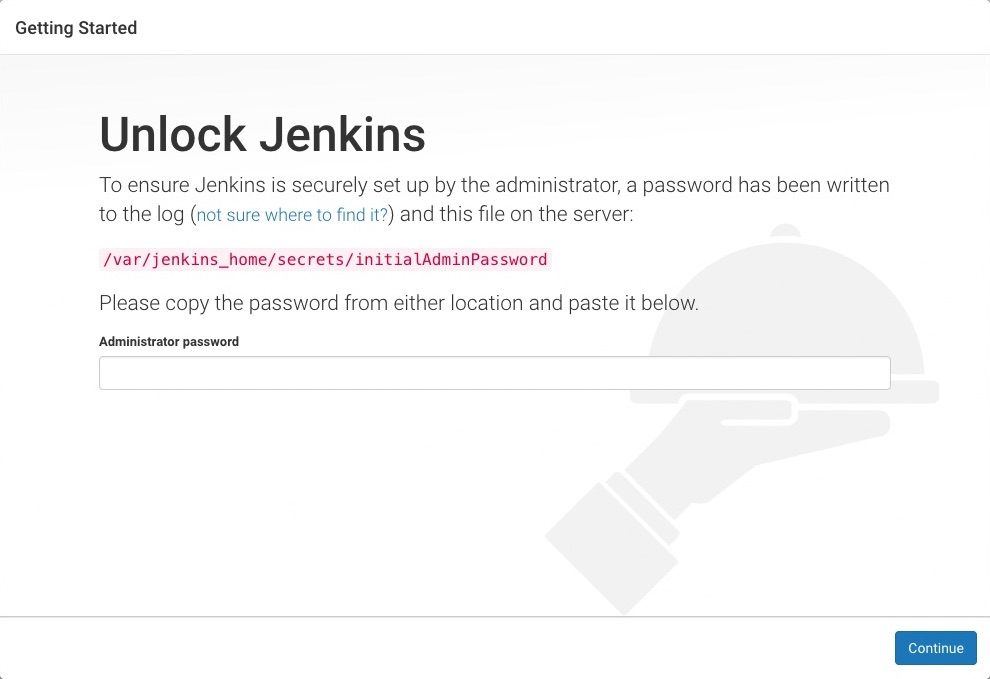
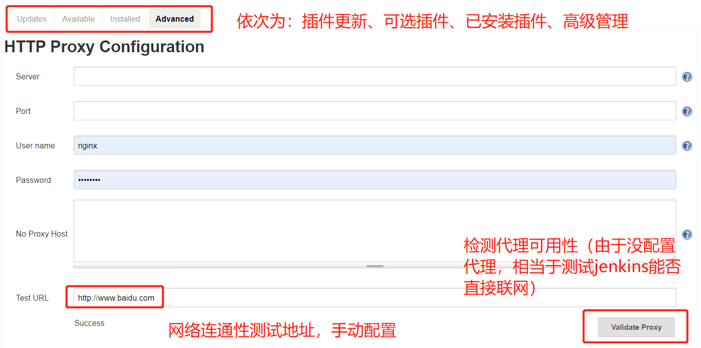
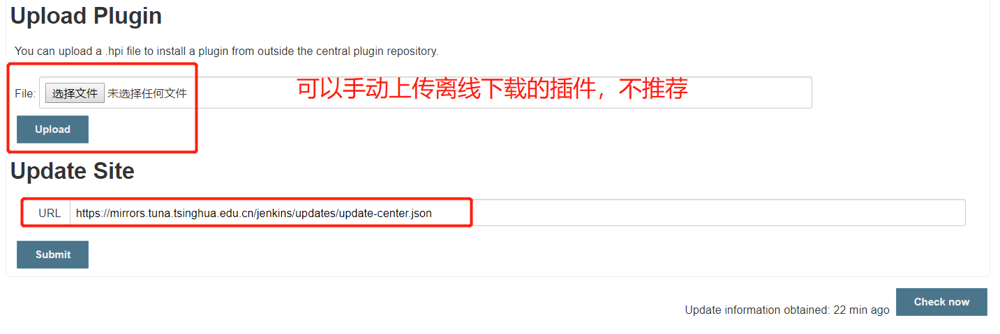
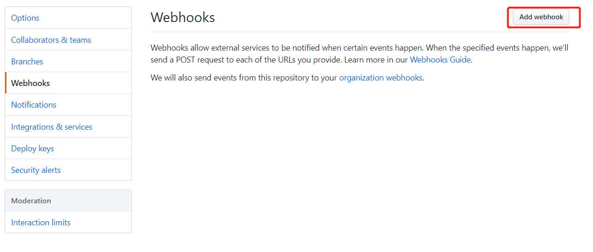
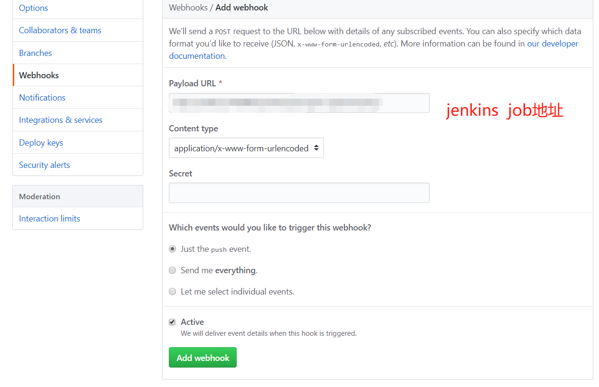
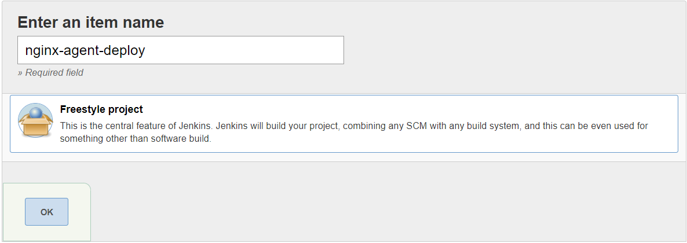

## Jenkins ##

### jenkins安装 ###

**方便起见我们假设jenkins宿主机IP为** `192.168.1.2`

CICD样例为：

jenkins + github + sornarQube + shell

`阿里云ECS`

`Centos7`

环境依赖

	系统要求
	最低推荐配置:
	
	256MB可用内存
	
	1GB可用磁盘空间(作为一个Docker容器运行jenkins的话推荐10GB)
	
	为小团队推荐的硬件配置:
	
	1GB+可用内存
	
	50 GB+ 可用磁盘空间
	
	软件配置:
	Java 8—​无论是Java运行时环境（JRE）还是Java开发工具包（JDK）都可以。

> 安装jdk1.8

	yum install -y java-1.8.0-openjdk.x86_64 java-1.8.0-openjdk-devel.x86_64

> 安装jenkins

	wget -O /etc/yum.repos.d/jenkins.repo https://pkg.jenkins.io/redhat-stable/jenkins.repo
	rpm --import https://pkg.jenkins.io/redhat-stable/jenkins.io.key
	yum install jenkins

> 调整默认配置

	sed -i "s#JENKINS_PORT=\"8080\"#JENKINS_PORT=\"8081\"#g" /etc/sysconfig/jenkins
	sed -i "s#JENKINS_ARGS=\"\"#s#JENKINS_ARGS=\"--prefix=/jenkins\"#g" /etc/sysconfig/jenkins

> 启动并开机自启动

	systemctl start jenkins
	systemctl enable jenkins

> 初始化jenkins账号

	浏览器访问
	http://192.168.1.2:8081/jenkins

根据提示获取管理员初始密码

	cat /var/lib/jenkins/secrets/initialAdminPassword

根据提示安装默认插件（默认即可，后续更改插件源地址，按需下载）

根据提示创建新用户

### 插件管理 ###

浏览器访问  http://192.168.1.2:8081/jenkins/pluginManager/advanced

> 按需配置代理

> 更改插件源为国内源

更改为清华源

	https://mirrors.tuna.tsinghua.edu.cn/jenkins/updates/update-center.json

**安装以下插件**

`Credentials Binding`

### github生成webhook ###

1、登录GitHub，进入要本次构建用到的工程

2、在工程主页面点击右上角的”Settings”，再点击左侧”Webhooks”，然后点击“Add webhook”，如下图：

3、如下图，在”Payload URL”位置填入webhook地址，再点击底部的”Add webhook按钮”，这样就完成webhook配置了，今后当前工程有代码提交，GitHub就会向此webhook地址发请求，通知Jenkins构建：

http://192.168.1.2:8081/jenkins/github-webhook/ 

4、push触发效果

### github生成Tocken ###

[图片内地址链接](https://github.com/settings/profile)

选择 “Personal access tokens”

选择"Generate new tocken"

勾选"repo与 admin:repo_hook"

点击最下方绿色按钮"Generate tocken"，复制该tocken

### jenkins配置github Tocken ###

访问jenkins系统设置页面，找到配置Github 服务器

**生成凭据**

**配置凭据**

**测试连通性**

### 构建项目 ###

> 1、创建一个项目

	http://192.168.1.2:8081/jenkins/view/all/newJob

### 常见问题 ###

安装插件时提示：`No valid crumb was included in the request`

**更改配置地址**

http://192.168.1.2:8081/jenkins/configureSecurity/)

解决方案：
在jenkins 的Configure Global Security下 , 取消“防止跨站点请求伪造（Prevent Cross Site Request Forgery exploits）”的勾选。

GitHub webhook出发时`You are authenticated as: anonymous 403`

解决方案：99%是tocken过期了，重新生成并配置

	