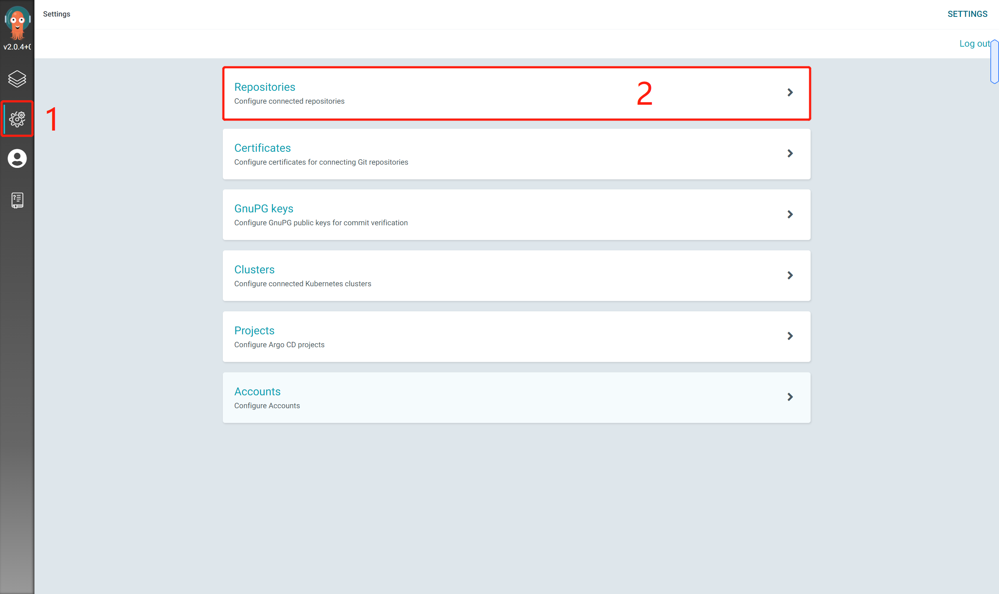
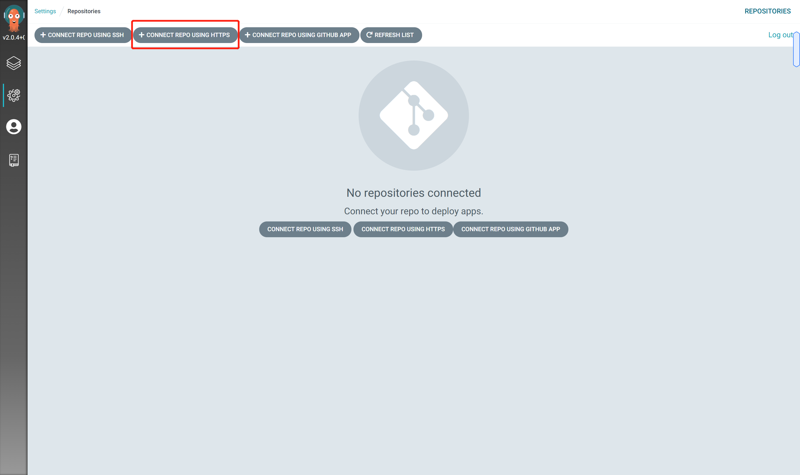
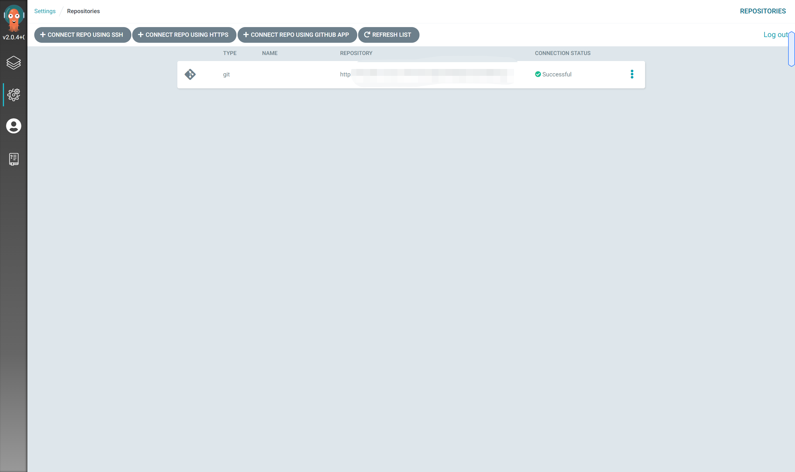

# Argo CD

## 简介

> `Argo CD`是什么？

`Argo CD`是一个基于`Kubernetes`声明性的`GitOps`持续交付工具

> 为什么使用`Argo CD`

- 声明式定义应用程序、配置和环境，并且是版本控制的

- 应用程序部署和生命周期管理是自动化的、可审计的和易于理解的

> 工作原理

`Argo CD`遵循`GitOps`模式，使用`Git`存储库作为定义应用程序期望状态的数据源。
`Kubernetes`应用清单可以通过以下几种方式指定:

- [kustomize应用](https://kustomize.io/)
- [helm应用](https://helm.sh/)
- [ksonnet应用](https://ksonnet.io/)
- [jsonnet](https://jsonnet.org/)
- 带有`yaml`|`json`清单的目录
- 任意自定义配置管理工具|插件

`Argo CD`可以在指定的目标环境中自动部署、维护期望的应用程序状态，该期望状态由清单文件定义。
应用程序清单版本可以基于`Git`提交时跟踪对分支、`tag`或固定到特定版本的`Git commit`。  

`Argo CD`基于`kubernetes`控制器实现，它持续监控运行中的应用程序，
并将当前的活动状态与期望的目标状态(如`Git repo`中所指定的)进行比较。
如果已部署的应用程序的活动状态偏离目标状态，则将被视为`OutOfSync`。
`Argo CD`可视化展现程序状态差异，同时提供自动或手动同步工具。

> 特性

- 将应用程序自动部署到指定的目标环境
- 支持多种应用配置管理工具/模板（`Kustomize, Helm, Ksonnet, Jsonnet, plain-YAML`）
- 能够管理和部署到多个`k8s`集群
- 单点登录（`OIDC, OAuth2, LDAP, SAML 2.0, GitHub, GitLab, Microsoft, LinkedIn`）
- 用于授权的多租户和`RBAC`策略
- 回滚至`Git`仓库中指定的`commit`
- 应用程序资源的运行状况分析
- 自动配置漂移检测和可视化
- 自动/手动同步应用至期望状态
- 提供应用程序活动的实时视图的`Web UI`
- 用于自动化和`CI`集成的`CLI`
- `Webhook`集成(`GitHub, BitBucket, GitLab`)
- `PreSync, Sync, PostSync`钩子来支持复杂应用(例如蓝/绿和金丝雀的升级)
- 应用程序事件审计和追踪`API`调用
- `Prometheus`指标
- 覆盖`Git`中`ksonnet/helm`的参数

## 核心概念

`argocd`架构示意图

以下`argocd`概念需要具有`Git、Docker、Kubernetes、Continuous Delivery`和`GitOps`相关背景

- `Application`(应用): 基于`Kubernetes CRD`定义的一组`Kubernetes`资源清单
- 应用数据源类型: 构建应用的工具类型(`helm`等)
- 目标状态: 描述应用的期望状态（如副本数、配额、调度等），由`git`仓库内的应用清单文件描述
- 活动状态: 描述应用的活动状态（如副本数、配额、调度、探针状态等）
- 同步状态: 描述应用活动状态与目标状态同步情况（是否一致）
- 同步: 一个动作，使应用程序（集群内）与目标状态（`git`仓库清单文件描述）达成一致
- 同步操作执行的状态: 描述同步动作是否成功
- 刷新: 对比`git`仓库内的应用目标状态与活动状态，指出不同之处
- 健康状态: 描述应用程序是否运行正常，可以对外提供服务
- 工具: 创建应用程序清单描述文件的工具（如`helm、Kustomize`）
   
### `Argo CD`中的项目

> `Argo CD`中项目是什么？

项目提供了应用程序的逻辑分组，这在`Argo CD`被多个团队使用时非常有用。项目提供以下特性:

- 限制部署的内容(如可`Git`源代码库)
- 限制应用部署的位置(目标`k8s`集群和命名空间)
- 限制可部署或不可部署的对象类型(例如`RBAC、CRDs、daemonset、NetworkPolicy`等)
- 定义项目角色以提供应用程序`RBAC`(绑定到`OIDC`组和/或`JWT`令牌)

> 关于默认项目

每个应用程序都属于一个项目。如果未指定，应用程序属于默认项目，该项目是自动创建的，
默认情况下允许从任何源`repo`部署到任何集群，以及所有资源类型。
默认业务群组只能被修改，不能被删除。最初创建时，它的规范声明如下:

    spec:
      sourceRepos:
      - '*'
      destinations:
      - namespace: '*'
        server: '*'
      clusterResourceWhitelist:
      - group: '*'
        kind: '*'

## 部署

> 下载声明文件

- [install.yaml](https://raw.githubusercontent.com/argoproj/argo-cd/stable/manifests/install.yaml)

> 发布

修改文件内镜像引用`tag`

    [root@node1 ~]# grep "image:" install.sh
            image: ghcr.io/dexidp/dex:v2.27.0
            image: quay.io/argoproj/argocd:v2.0.4
            image: redis:6.2.4-alpine
            image: quay.io/argoproj/argocd:v2.0.4
            image: quay.io/argoproj/argocd:v2.0.4
            image: quay.io/argoproj/argocd:v2.0.4
            
发布创建

    kubectl create namespace argocd
    kubectl apply -n argocd -f install.yaml
    
查看部署状态

    [root@node1 ~]# kubectl get pod -n argocd -w
    NAME                                  READY   STATUS    RESTARTS   AGE
    argocd-application-controller-0       1/1     Running   0          113s
    argocd-dex-server-764699868-28tmj     1/1     Running   0          113s
    argocd-redis-675b9bbd9d-dtbzh         1/1     Running   0          113s
    argocd-repo-server-59ffd86d98-2w7k4   1/1     Running   0          113s
    argocd-server-6d66686c5c-nqfpf        1/1     Running   0          113s

> 调整服务类型为`NodePort`

    kubectl -n argocd expose deployments/argocd-server --type="NodePort" --port=8080 --name=argocd-server-nodeport

获取`NodePort`

    [root@node1 ~]# kubectl get service/argocd-server-nodeport -n argocd
    NAME                     TYPE       CLUSTER-IP      EXTERNAL-IP   PORT(S)          AGE
    argocd-server-nodeport   NodePort   10.233.34.101   <none>        8080:31398/TCP   87s

> 查看登录口令

    kubectl -n argocd get secret argocd-initial-admin-secret -o jsonpath="{.data.password}" | base64 -d|xargs -n1 echo
      
> 登录

- 登录地址： http://NodeIP:31418

## 实践

### 源代码库

### 配置库
        

### 配置默认argocd项目

> 配置仓库

`web`控制台进入仓库配置界面

点击`CONNECT REPO USING HTTPS`添加仓库

配置相关信息点击`CONNECT`

查看项目下仓库状态

### 最佳实践

> 分离配置库和源代码库

使用单独的`Git`存储库来保存`kubernetes`清单，将配置与应用程序源代码分开，强烈推荐使用，原因如下:

- 清晰分离了应用程序代码与应用程序配置。有时您希望只修改清单，而不触发整个`CI`构建。
例如，如果您只是希望增加部署规范中的副本数量，那么您可能不希望触发构建（由于构建周期可能较长）
- 更清洁的审计日志。出于审计目的，只保存配置库历史更改记录，而不是掺有日常开发提交的日志记录。
- 微服务场景下，应用程序可能由多个`Git`库构建的服务组成，但是作为单个单元部署（比如同一`pod`内）。
通常，微服务应用由不同版本和不同发布周期的服务组成(如E`LK, Kafka + Zookeeper`)。
将配置清单存储在单个组件的一个源代码库中可能没有意义
- 访问的分离。开发应用程序的开发人员不一定是能够/应该推送到生产环境的同一个人，无论是有意的还是无意的。
通过使用单独的库，可以将提交访问权限授予源代码库，而不是应用程序配置库
- 自动化`CI Pipeline`场景下，将清单更改推送到同一个`Git`存储库可能会触发构建作业和`Git`提交触发器的无限循环。
使用一个单独的`repo`来推送配置更改，可以防止这种情况发生。

> 确保在`Git`版本中的清单是真正不可变的

当使用像`helm`或`kustomize`这样的模板工具时，清单的内容可能会随着时间的推移而改变。
这通常是由对上游`helm`库或`kustomize`库的更改引起的。

以下面`kustomization.yaml`为例

    bases:
    - github.com/argoproj/argo-cd//manifests/cluster-install
    
由于这不是一个稳定的目标，因此这个自定义应用程序的清单可能会突然改变内容，甚至不需要对自己的`Git`存储库进行任何更改。（比如`git master`分支）
    
更好的选择是使用`Git`标记或提交`SHA`的版本。例如:

    bases:
    - github.com/argoproj/argo-cd//manifests/cluster-install?ref=v0.11.1
    

    

   

  

  

  

    

  

