<!-- START doctoc generated TOC please keep comment here to allow auto update -->
<!-- DON'T EDIT THIS SECTION, INSTEAD RE-RUN doctoc TO UPDATE -->
**Table of Contents**  *generated with [DocToc](https://github.com/thlorenz/doctoc)*

- [OpenEBS](#openebs)
  - [简介](#%E7%AE%80%E4%BB%8B)
    - [`OpenEBS`是什么？](#openebs%E6%98%AF%E4%BB%80%E4%B9%88)
    - [`OpenEBS`能做什么？](#openebs%E8%83%BD%E5%81%9A%E4%BB%80%E4%B9%88)
    - [对比传统分布式存储](#%E5%AF%B9%E6%AF%94%E4%BC%A0%E7%BB%9F%E5%88%86%E5%B8%83%E5%BC%8F%E5%AD%98%E5%82%A8)
    - [OpenEBS存储引擎建议](#openebs%E5%AD%98%E5%82%A8%E5%BC%95%E6%93%8E%E5%BB%BA%E8%AE%AE)
    - [OpenEBS特性](#openebs%E7%89%B9%E6%80%A7)
    - [CAS介绍](#cas%E4%BB%8B%E7%BB%8D)
  - [OpenESB架构介绍](#openesb%E6%9E%B6%E6%9E%84%E4%BB%8B%E7%BB%8D)
    - [控制面](#%E6%8E%A7%E5%88%B6%E9%9D%A2)
    - [数据面](#%E6%95%B0%E6%8D%AE%E9%9D%A2)
  - [CAS引擎](#cas%E5%BC%95%E6%93%8E)
    - [存储引擎概述](#%E5%AD%98%E5%82%A8%E5%BC%95%E6%93%8E%E6%A6%82%E8%BF%B0)
    - [存储引擎类型](#%E5%AD%98%E5%82%A8%E5%BC%95%E6%93%8E%E7%B1%BB%E5%9E%8B)
    - [存储引擎声明](#%E5%AD%98%E5%82%A8%E5%BC%95%E6%93%8E%E5%A3%B0%E6%98%8E)
    - [CAS引擎使用场景](#cas%E5%BC%95%E6%93%8E%E4%BD%BF%E7%94%A8%E5%9C%BA%E6%99%AF)
    - [节点磁盘管理器（`NDM`）](#%E8%8A%82%E7%82%B9%E7%A3%81%E7%9B%98%E7%AE%A1%E7%90%86%E5%99%A8ndm)
  - [落地实践](#%E8%90%BD%E5%9C%B0%E5%AE%9E%E8%B7%B5)
    - [Local PV Hostpath实践](#local-pv-hostpath%E5%AE%9E%E8%B7%B5)
    - [Local PV Device实践](#local-pv-device%E5%AE%9E%E8%B7%B5)
    - [总结](#%E6%80%BB%E7%BB%93)

<!-- END doctoc generated TOC please keep comment here to allow auto update -->

# OpenEBS

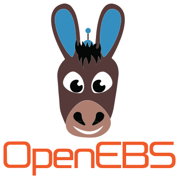

## 简介

### `OpenEBS`是什么？

`OpenEBS`是一种开源云原生存储解决方案，托管于`CNCF`基金会，目前该项目处于沙箱阶段，

`OpenEBS`是一组存储引擎，允许您为有状态工作负载(`StatefulSet`)和`Kubernetes`平台类型选择正确的存储解决方案。
在高层次上，`OpenEBS`支持两大类卷——本地卷和复制卷

`OpenEBS`是`Kubernetes`本地超融合存储解决方案，它管理节点可用的本地存储，并为有状态工作负载提供本地或高可用的分布式持久卷。
作为一个完全的`Kubernetes`原生解决方案的另一个优势是，管理员和开发人员可以使用`kubectl`、`Helm`、
`Prometheus`、`Grafana`、`Weave Scope`等`Kubernetes`可用的所有优秀工具来交互和管理`OpenEBS`

### `OpenEBS`能做什么？

`OpenEBS`管理`k8s`节点上存储，并为`k8s`有状态负载（`StatefulSet`）提供本地存储卷或分布式存储卷。

- 本地卷（`Local Storage`）

    - `OpenEBS`可以使用宿主机裸块设备或分区，或者使用`Hostpaths`上的子目录，或者使用`LVM`、`ZFS`来创建持久化卷
    - 本地卷直接挂载到`Stateful Pod`中，而不需要`OpenEBS`在数据路径中增加任何开销
    - `OpenEBS`为本地卷提供了额外的工具，用于监控、备份/恢复、灾难恢复、由`ZFS`或`LVM`支持的快照等

- 对于分布式卷(即复制卷)
  
    - `OpenEBS`使用其中一个引擎(`Mayastor`、`cStor`或`Jiva`)为每个分布式持久卷创建微服务
    - 有状态`Pod`将数据写入`OpenEBS`引擎，`OpenEBS`引擎将数据同步复制到集群中的多个节点。
    `OpenEBS`引擎本身作为`pod`部署，并由`Kubernetes`进行协调。
    当运行`Stateful Pod`的节点失败时，`Pod`将被重新调度到集群中的另一个节点，`OpenEBS`将使用其他节点上的可用数据副本提供对数据的访问
    - 有状态的`Pods`使用`iSCSI` (`cStor`和`Jiva`)或`NVMeoF` (`Mayastor`)连接`OpenEBS`分布式持久卷
    - `OpenEBS cStor`和`Jiva`专注于存储的易用性和持久性。它们分别使用自定义版本的`ZFS`和`Longhorn`技术将数据写入存储。
    `OpenEBS Mayastor`是最新开发的以耐久性和性能为设计目标的引擎，高效地管理计算(大页面、核心)和存储(`NVMe Drives`)，以提供快速分布式块存储

**注意:**

`OpenEBS`分布式块卷被称为复制卷，以避免与传统的分布式块存储混淆，传统的分布式块存储倾向于将数据分布到集群中的许多节点上。
复制卷是为云原生有状态工作负载设计的，这些工作负载需要大量的卷，这些卷的容量通常可以从单个节点提供，而不是使用跨集群中的多个节点分片的单个大卷
    

### 对比传统分布式存储

`OpenEBS`与其他传统存储解决方案不同的几个关键方面:

- 使用微服务体系结构构建，就像它所服务的应用程序一样。
`OpenEBS`本身作为一组容器部署在`Kubernetes`工作节点上。使用`Kubernetes`本身来编排和管理`OpenEBS`组件

- 完全建立在用户空间，使其高度可移植性，以运行在任何操作系统/平台。
  
- 完全意图驱动，继承了`Kubernetes`易用性的相同原则

- `OpenEBS`支持一系列存储引擎，因此开发人员可以部署适合于其应用程序设计目标的存储技术。
像`Cassandra`这样的分布式应用程序可以使用`LocalPV`引擎进行最低延迟的写操作。
像`MySQL`和`PostgreSQL`这样的单片应用程序可以使用使用`NVMe`和`SPDK`构建的`Mayastor`或基于`ZFS`的`cStor`来实现弹性。
像`Kafka`这样的流媒体应用程序可以在边缘环境中使用`NVMe`引擎`Mayastor`以获得最佳性能。
  

驱使用户使用`OpenEBS`的主要原因是:

- 在所有的`Kubernetes`发行版上都是可移植的
- 提高了开发人员和平台`SRE`的生产力
- 与其他解决方案相比，易于使用
- 优秀的社区支持
- 免费开源

> 本地卷类型

本地卷只能从集群中的单个节点访问。必须在提供卷的节点上调度使用`Local Volume`的`Pods`。
本地卷通常是分布式工作负载的首选，比如`Cassandra`、`MongoDB`、`Elastic`等，这些工作负载本质上是分布式的，并且内置了高可用性（分片）

根据附加到`Kubernetes`工作节点上的存储类型，您可以从不同的动态本地`PV`进行选择——`Hostpath`、`Device`、`LVM`、`ZFS`或`Rawfile`

> 可复制卷类型

`复制卷`顾名思义，是指将数据同步复制到多个节点的卷。卷可以支持节点故障。还可以跨可用性区域设置复制，以帮助应用程序跨可用性区域移动。

复制卷还能够提供像快照、克隆、卷扩展等企业存储特性。复制卷是有状态工作负载(如`Percona/MySQL`、`Jira`、`GitLab`等)的首选。

根据附加到`Kubernetes`工作节点的存储类型和应用程序性能需求，您可以从`Jiva、cStor`或`Mayastor`中进行选择

### OpenEBS存储引擎建议

| 应用需求 | 存储类型 | OpenEBS卷类型 |
| :-----:| :----: | :----: |
| 低时延、高可用性、同步复制、快照、克隆、精简配置 | SSD/云存储卷 | OpenEBS Mayastor |
| 高可用性、同步复制、快照、克隆、精简配置 | 机械/SSD/云存储卷 | OpenEBS cStor |
| 高可用性、同步复制、精简配置 | 主机路径或外部挂载存储 | OpenEBS Jiva |
| 低时延、本地PV | 主机路径或外部挂载存储 | Dynamic Local PV - Hostpath, Dynamic Local PV - Rawfile |
| 低时延、本地PV | 本地机械/SSD/云存储卷等块设备 | Dynamic Local PV - Device |
| 低延迟，本地PV，快照，克隆 | 本地机械/SSD/云存储卷等块设备 | OpenEBS Dynamic Local PV - ZFS , OpenEBS Dynamic Local PV - LVM |

总结：

- 多机环境，如果有额外的块设备（非系统盘块设备）作为数据盘，选用`OpenEBS Mayastor`、`OpenEBS cStor`
- 多机环境，如果没有额外的块设备（非系统盘块设备）作为数据盘，仅单块系统盘块设备，选用`OpenEBS Jiva`
- 单机环境，建议本地路径`Dynamic Local PV - Hostpath, Dynamic Local PV - Rawfile`，由于单机多用于测试环境，数据可靠性要求较低。

由此看来，`OpenEBS`常用场景为以上三个场景

### OpenEBS特性

> 容器附加存储

`OpenEBS`是一个容器附加存储(`Container Attached Storage, CAS`)的例子。
通过`OpenEBS`提供的卷总是被容器化。每个卷都有一个专用的存储控制器，用于提高有状态应用程序的持久性存储操作的敏捷性和粒度。

> 同步复制
  
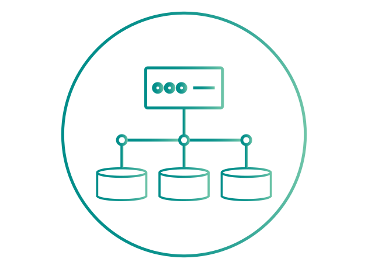

同步复制是`OpenEBS`的一个可选的流行特性。
当与`Jiva`、`cStor`和`Mayastor`存储引擎一起使用时，`OpenEBS`可以同步复制数据卷以实现高可用性。
跨`Kubernetes`区域进行复制，从而为跨`AZ`设置提供高可用性。
这个特性对于使用`GKE、EKS`和`AKS`等云提供商服务上的本地磁盘构建高可用状态应用程序特别有用

> 快照和克隆

  
写时拷贝快照是`OpenEBS`另一个可选的流行特性。
使用`cStor`引擎时，快照是瞬时创建的，并且不受快照个数的限制。
增量快照功能增强了跨`Kubernetes`集群和跨不同云提供商或数据中心的数据迁移和可移植性。
对快照和克隆的操作完全以`Kubernetes`原生方法执行，使用标准`kubectl`命令。
常见的用例包括用于备份的高效复制和用于故障排除或针对数据的只读副本进行开发的克隆

> 备份和恢复
  

`OpenEBS`卷的备份和恢复可以通过开源的`OpenEBS Velero`插件与`Kubernetes`备份和恢复解决方案(如`Velero`(前身为`Heptio Ark`))协同工作。
经常使用`OpenEBS`增量快照功能，将数据备份到`AWS S3、GCP object storage、MinIO`等对象存储目标。
这种存储级别的快照和备份只使用增量数据进行备份，节省了大量的带宽和存储空间。

> 真正的`Kubernetes`云原生存储

  

`OpenEBS`是`Kubernetes`上有状态应用程序的云原生存储，`云原生`意味着遵循松散耦合的体系结构。
因此，云原生、松散耦合体系结构的一般好处是适用的。
例如，开发人员和`DevOps`架构师可以使用标准的`Kubernetes`技能和实用程序来配置、使用和管理持久存储需求

> 减少存储`TCO`高达`50%`

在大多数云上，块存储的收费是基于购买的多少，而不是使用的多少;
为了实现更高的性能，并在充分利用容量时消除中断的风险，容量经常被过度配置。
`OpenEBS`的精简配置能力可以共享本地存储或云存储，然后根据需要增加有状态应用程序的数据量。
可以动态添加存储，而不会中断暴露给工作负载或应用程序的卷。
某些用户报告说，由于使用了`OpenEBS`的精简配置，节省了超过`60%`的资源。

> 高可用性

由于`OpenEBS`遵循`CAS`架构，在节点故障时，`Kubernetes`将重新调度`OpenEBS`控制器，而底层数据则通过使用一个或多个副本来保护。
更重要的是——因为每个工作负载都可以利用自己的`OpenEBS`——不存在因存储丢失而导致系统大范围宕机的风险。
例如，卷的元数据不是集中的，它可能会像许多共享存储系统那样受到灾难性的通用中断的影响。
相反，元数据保持在卷的本地。丢失任何节点都会导致只存在于该节点上的卷副本的丢失。
由于卷数据至少在其他两个节点上进行了同步复制，因此当一个节点出现故障时，这些数据将在相同的性能级别上继续可用

### CAS介绍

在`CAS`或容器附加存储(`Container Attached Storage`)体系结构中，存储在容器中运行，并且与存储绑定到的应用程序密切相关。
存储作为微服务运行，没有内核模块依赖关系。
像`Kubernetes`这样的编排系统编排存储卷，就像任何其他微服务或容器一样。`CAS`具有`DAS`和`NAS`的优点

> 非`CAS`系统上的`pv`

在非`CAS`模型中，`Kubernetes`持久卷仍然与内核模块紧密耦合，使得`Kubernetes`节点上的存储软件本质上是单片的

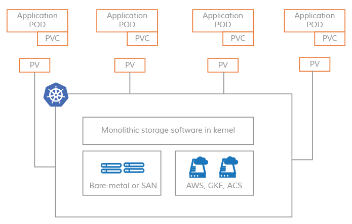

> 基于`CAS`系统上的`pv`

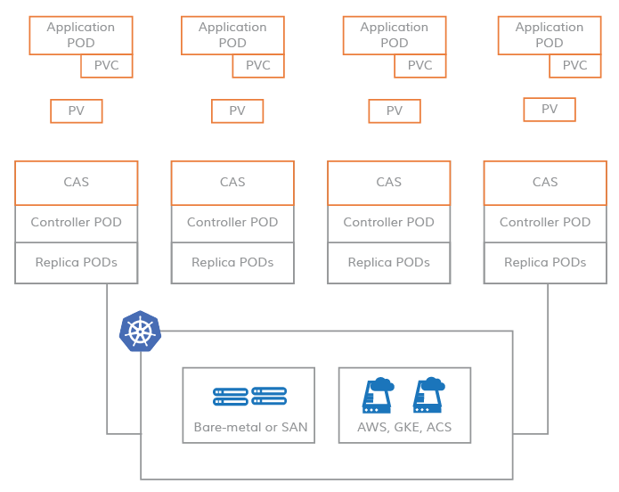

相反，`CAS`使您能够利用云原生应用程序的灵活性和可伸缩性。
定义`Kubernetes PV (Persistent Volume)`的存储软件是基于微服务架构的。
存储软件的控制平面(存储控制器)和数据平面(存储副本)作为`Kubernetes Pods`运行，因此，使您能够将云原生的所有优势应用到`CAS`。

> CAS优势

- 敏捷

`CAS`中的每个存储卷都有一个容器化的存储控制器和相应的容器化副本。
因此，围绕这些组件的资源的维护和调优是真正敏捷的。
`Kubernetes`滚动升级功能可以实现存储控制器和存储副本的无缝升级。可以使用容器`cGroups`调优`CPU`和内存等资源配额。

- 存储策略粒度化
  
将存储软件容器化并将存储控制器专用于每个卷可以带来最大的存储策略粒度。
在`CAS`体系结构中，可以按卷配置所有存储策略。
此外，您可以监视每个卷的存储参数，并动态更新存储策略，以实现每个工作负载的预期结果。
随着卷存储策略中这种额外粒度级别的增加，存储吞吐量、`IOPS`和延迟的控制也会增加。

- 云原生

`CAS`将存储软件装入容器，并使用`Kubernetes`自定义资源定义(`CRDs`)来声明低级存储资源，如磁盘和存储池。
这个模型使存储能够无缝地集成到其他云原生工具中。
可以使用`Prometheus、Grafana、Fluentd、Weavescope、Jaeger`等云原生工具来供应、监控和管理存储资源

- `PV`是`CAS`中的一个微服务
  
如上图所示，在`CAS`架构中，存储控制器和副本的软件完全是基于微服务的，因此不涉及内核组件。
通常，存储控制器`POD`被调度在与持久卷相同的节点上，以提高效率，副本`POD`可以被调度在集群节点上的任何位置。
每个副本使用本地磁盘、`SAN`磁盘和云磁盘的任意组合完全独立于其他副本进行配置。
这为大规模管理工作负载的存储分配提供了巨大的灵活性。

- 超融合非分布式

`CAS`架构没有遵循典型分布式存储架构。通过从存储控制器到存储副本的同步复制，存储变得高度可用。
卷副本的元数据不是在节点之间共享的，而是在每个本地节点上独立管理。
如果一个节点故障，存储控制器(在本例中是一个无状态容器)将在一个节点上轮转，该节点上运行着第二个或第三个副本，数据仍然可用。

与超融合系统类似，`CAS`中的卷的存储和性能是可扩展的。由于每个卷都有自己的存储控制器，因此存储可以在一个节点的存储容量允许的范围内进行扩展。
在给定的`Kubernetes`集群中，随着容器应用程序数量的增加，会增加更多的节点，从而提高存储容量和性能的整体可用性，从而使存储对新的应用程序容器可用。
这一过程与`Nutanix`等成功的超融合系统非常相似。

## OpenESB架构介绍

`OpenESB`遵循容器附加存储（`CAS`）模型，每个卷都有一个专用的控制器`POD`和一组副本`POD`。
`CAS`体系结构的优点在[`CNCF`博客](https://www.cncf.io/blog/2018/04/19/container-attached-storage-a-primer/) 上进行了讨论。
`OpenEBS`操作和使用都很简单，因为它看起来和感觉上就像其他云原生和`Kubernetes`友好的项目。

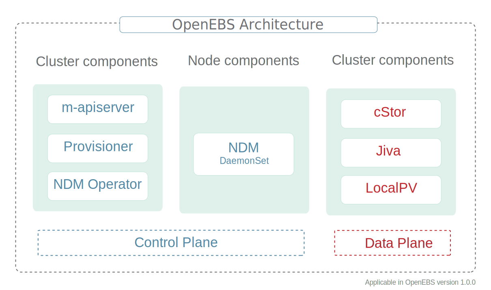

`OpenEBS`有许多组件，可以分为以下类别:

- 控制面组件 - `Provisioner`, `API Server`, `volume exports`,`volume sidecars`
- 数据面组件 - `Jiva`、`cStor`
- 节点磁盘管理器 - `Discover`, `monitor`, 管理连接`k8s`的媒介
- 与云原生工具的集成 - 已经与`Prometheus`,`Grafana`, `Fluentd`、`Jaeger`集成

### 控制面

`OpenEBS`集群的控制平面通常被称为`Maya`

`OpenEBS`控制平面负责提供卷、相关的卷操作，如快照、克隆、创建存储策略、执行存储策略、导出`Prometheus/grafana`使用的卷指标，等等。

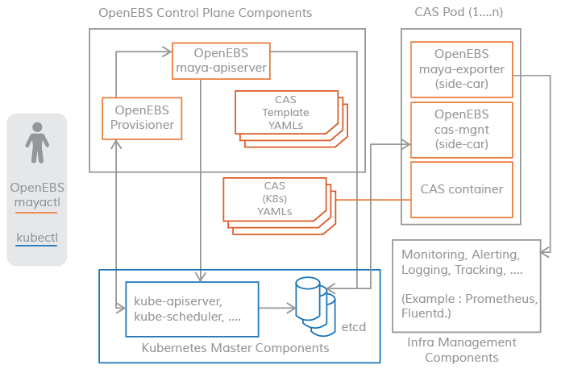

`OpenEBS`提供了一个动态提供程序，这是`Kubernetes`的标准外部存储插件。
`OpenEBS PV`提供者的主要任务是向应用程序`PODS`启动卷供应，并实现`PV`的`Kubernetes`规范。

`m-apiserver`开放存储的`REST API`，并承担大量卷策略处理和管理工作。

控制平面和数据平面之间的连通性使用`Kubernetes sidecar`模式。控制平面需要与数据平面通信的场景如下所示。
      
- 对于卷的统计，如`IOPS`，吞吐量，延迟等--通过卷暴漏的`sidecar`实现
  
- 使用卷控制器`pod`执行卷策略，使用卷副本`pod`进行磁盘/池管理-通过卷管理`sidecar`实现

> `OpenEBS PV Provisioner`

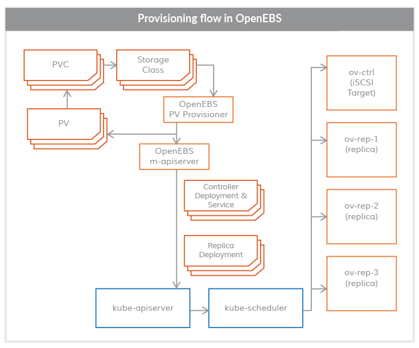

此组件作为`POD`运行，并做出配置决策,它的使用方式是:

开发人员用所需的卷参数构造一个声明，选择适当的存储类，并在`YAML`规范上调用`kubelet`。
`OpenEBS PV`动态提供程序与`maya-apiserver`交互，在适当的节点上为卷控制器`pod`和卷副本`pod`创建部署规范。
可以使用`PVC`规范中的注释来控制卷`Pod`(控制器/副本)的调度。

目前，`OpenEBS Provisioner`只支持一种绑定类型，即`iSCSI`。

> `Maya-ApiServer`

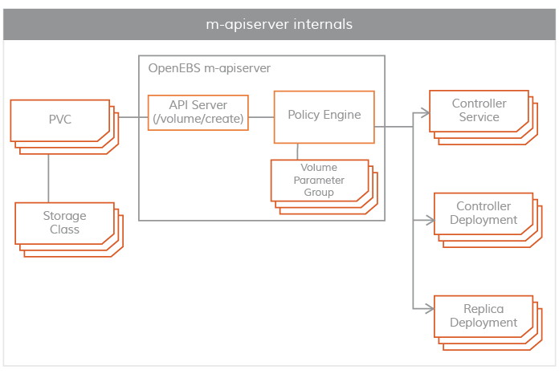

`m-apiserver`作为`POD`运行。顾名思义，`m-apiserver`公开`OpenEBS REST api`

`m-apiserver`还负责创建创建卷`pod`所需的部署规范文件。
在生成这些规范文件之后，它将调用`kube-apiserver`来相应地调度这些`pods`。
`OpenEBS PV`提供者在卷发放结束时，将创建一个`PV`对象并将其挂载到应用程序`pod`上。
`PV`由控制器`pod`承载，控制器`pod`由不同节点中的一组副本`pod`支持。
控制器`pod`和复制`pod`是数据平面的一部分，在存储引擎部分有更详细的描述。

`m-apiserver`的另一个重要任务是卷策略管理。`OpenEBS`为表示策略提供了非常细粒度的规范。
`m-apiserver`解释这些`YAML`规范，将它们转换为可执行的组件，并通过容量管理`sidecar`来执行它们

> `Maya Volume Exporter`

`Maya`卷导出器是每个存储控制器`pod`的`sidecar`

这些`sidecar`将控制平面连接到数据平面以获取统计信息。统计信息的粒度在卷级别。一些统计数据示例如下：

- 卷读取延迟
- 卷写入延迟
- 卷每秒读取速度
- 卷每秒写入速度
- 读取块大小
- 写入块大小
- 容量统计
  
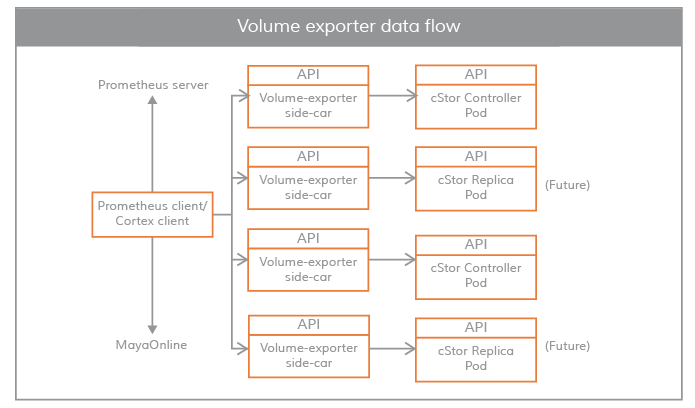

这些统计信息通常由`Prometheus`客户端来拉取，该客户端在`OpenBS`安装期间安装和配置

> 卷管理`sidecar`
  
`Sidecars`还用于将控制器配置参数和卷策略传递给卷控制器`pod`(卷控制器`pod`是一个数据平面)，
并将副本配置参数和副本数据保护参数传递给卷副本`pod`。

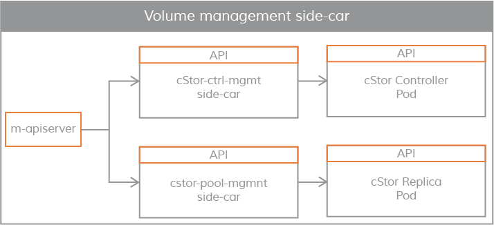

### 数据面

`OpenEBS`数据平面负责实际的卷`IO`路径。存储引擎在数据平面实现实际的`IO`路径。
目前，`OpenEBS`提供了两个可以轻松插入的存储引擎。它们被称为`Jiva`和`cStor`。
这两个存储引擎都完全运行在`Linux`用户空间中，并基于微服务架构。

> `Jiva`

`Jiva`存储引擎基于`Rancher's LongHorn`与`gotgt`开发实现， 使用`go`语言开发，并运行于用户命名空间下。
`LongHorn`控制器将输入的`IO`同步复制到`LongHorn`副本。该副本将`Linux`稀疏文件视为构建存储特性(如精简配置、快照、重建等)的基础。

> `cStor`

`cStor`数据引擎使用`C`语言编写，具有高性能的`iSCSI target`和`Copy-On-Write`块系统，提供数据完整性、数据弹性和时间点的快照和克隆。
`cStor`有一个池特性，它以条带、镜像或`RAIDZ`模式聚合一个节点上的磁盘，以提供更大的容量和性能单位。
`cStor`还可以跨区域将数据同步复制到多个节点，从而避免节点丢失或节点重启导致数据不可用。

> `LocalPV`

对于那些不需要存储级复制的应用程序，`LocalPV`可能是很好的选择，因为它能提供更高的性能。
`OpenEBS LocalPV`与`Kubernetes LocalPV`类似，不同之处在于它是由`OpenEBS`控制平面动态提供的，
就像任何其他常规`PV`一样。`OpenEBS LocalPV`有两种类型:`hostpath LocalPV`和`device LocalPV`。
`hostpath LocalPV`指的是主机上的子目录，`LocalPV`指的是在节点上发现的磁盘(可以是直接连接的，也可以是网络连接的)。
`OpenEBS`引入了一个`LocalPV`提供者，用于根据`PVC`和存储类规范中的一些标准选择匹配的磁盘或主机路径。

> 节点磁盘管理器
  
节点磁盘管理器(`NDM`)填补了使用`Kubernetes`管理有状态应用程序的持久存储所需的工具链的空白。
容器时代的`DevOps`架构师必须以一种自动化的方式满足应用程序和应用程序开发人员的基础设施需求，
这种方式可以跨环境提供弹性和一致性。这些要求意味着存储堆栈本身必须非常灵活，
以便`Kubernetes`和云原生生态系统中的其他软件可以轻松地使用这个堆栈。
`NDM`在`Kubernetes`的存储堆栈中起着基础性的作用，它统一了不同的磁盘，
并通过将它们标识为`Kubernetes`对象，提供了将它们汇聚的能力。
此外，`NDM`发现、提供、监视和管理底层磁盘的方式，可以让`Kubernetes PV`提供者(如`OpenEBS`和其他存储系统)和`Prometheus`管理磁盘子系统

## CAS引擎

### 存储引擎概述

存储引擎是持久化卷`IO`路径的数据平面组件。
在`CAS`架构中，用户可以根据不同的配置策略，为不同的应用工作负载选择不同的数据平面。
存储引擎可以通过特性集或性能优化给定的工作负载。

操作员或管理员通常选择具有特定软件版本的存储引擎，并构建优化的卷模板，
这些卷模板根据底层磁盘的类型、弹性、副本数量和参与`Kubernetes`集群的节点集进行微调。
用户可以在发放卷时选择最优的卷模板，从而在给定的`Kubernetes`集群上为所有存储卷运行最优的软件和存储组合提供最大的灵活性。

### 存储引擎类型

`OpenEBS`提供了三种存储引擎

- `Jiva `

    `Jiva`是`OpenEBS 0.1`版中发布的第一个存储引擎，使用起来最简单。它基于`GoLang`开发，内部使用`LongHorn`和`gotgt`堆栈。
    `Jiva`完全在用户空间中运行，并提供同步复制等标准块存储功能。
    `Jiva`通常适用于容量较小的工作负载，不适用于大量快照和克隆特性是主要需求的情况
  
- `cStor`

    `cStor`是`OpenEBS 0.7`版本中最新发布的存储引擎。`cStor`非常健壮，提供数据一致性，很好地支持快照和克隆等企业存储特性。
    它还提供了一个健壮的存储池特性，用于在容量和性能方面进行全面的存储管理。
    `cStor`与`NDM` (`Node Disk Manager`)一起，为`Kubernetes`上的有状态应用程序提供完整的持久化存储特性  
    
- `OpenEBS Local PV`

    `OpenEBS Local PV`是一个新的存储引擎，它可以从本地磁盘或工作节点上的主机路径创建持久卷或`PV`。
    `CAS`引擎可以从`OpenEBS`的`1.0.0`版本中获得。使用`OpenEBS Local PV`，性能将等同于创建卷的本地磁盘或文件系统(主机路径)。
    许多云原生应用程序可能不需要复制、快照或克隆等高级存储特性，因为它们本身就提供了这些特性。这类应用程序需要以持久卷的形式访问管理的磁盘
  
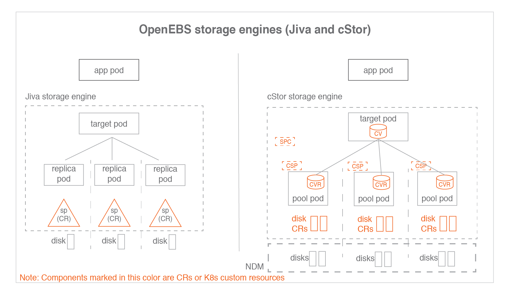

- `SP` 
    存储池，表示`Jiva`自定义存储资源

- `CV`
    `cStor`卷，表示`cStor`卷自定义资源

- `CVR`
    `cStor`卷副本
    
- `SPC`
    存储池声明，表示`cStor`池聚合的自定义资源
 
- `CSP`
    `cStor`存储池，表示`cStor Pool`每个节点上的自定义资源
    
一个`SPC`对应多个`CSP`，相应的一个`CV`对应多个`CVR`

### 存储引擎声明

通过指定注释`openebs`来选择存储引擎。
`StorageClass`规范中的`io/cas-type`。`StorageClass`定义了提供程序的细节。为每个`CAS`引擎指定单独的供应程序。

> `cStor`存储类规范文件内容

    ---
    apiVersion: storage.k8s.io/v1
    kind: StorageClass
    metadata:
      name: cStor-storageclass
      annotations:
        openebs.io/cas-type: cstor
        cas.openebs.io/config: |
          - name: StoragePoolClaim
            value: "cStorPool-SSD"
    provisioner: openebs.io/provisioner-iscsi
    ---

> `Jiva`存储类规范文件内容

    ---
    apiVersion: storage.k8s.io/v1
    kind: StorageClass
    metadata:
      name: jiva-storageclass
      annotations:
        openebs.io/cas-type: jiva
        cas.openebs.io/config: |
          - name: StoragePool
            value: default
    provisioner: openebs.io/provisioner-iscsi
    ---
    
当`cas`类型为`Jiva`时，`StoragePool`的`default`值具有特殊含义。
当`pool`为默认值时，`Jiva`引擎将从容器(副本`pod`)本身的存储空间中为副本`pod`开辟数据存储空间。
当所需的卷大小很小(比如`5G`到`10G`)时，`StoragePool default`工作得很好，因为它可以容纳在容器本身内。

> `Local PV`存储类规范文件内容-主机路径

    ---
    apiVersion: storage.k8s.io/v1
    kind: StorageClass
    metadata:
      name: localpv-hostpath-sc
      annotations:
        openebs.io/cas-type: local
        cas.openebs.io/config: |
          - name: BasePath
            value: "/var/openebs/local"
          - name: StorageType
            value: "hostpath"
    provisioner: openebs.io/local
    ---
    
> `Local PV`存储类规范文件内容-主机设备

    ---
    apiVersion: storage.k8s.io/v1
    kind: StorageClass
    metadata:
      name: localpv-device-sc
      annotations:
        openebs.io/cas-type: local
        cas.openebs.io/config: |
          - name: StorageType
            value: "device"
          - name: FSType
            value: ext4
    provisioner: openebs.io/local
    ---
    
`cStor`、`Jiva`、`LocalPV`特性比较：

| 特性 | Jiva | cStor | Local PV |
| :-----:| :----: | :----: | :----: |
| 轻量级运行于用户空间 | Yes | Yes | Yes |
| 同步复制 | Yes | Yes | No |
| 适合低容量工作负载 | Yes | Yes | Yes |
| 支持快照，克隆 | Basic | Advanced | No |
| 数据一致性 | Yes | Yes | NA |
| 使用Velero恢复备份 | Yes | Yes | Yes |
| 适合高容量工作负载 | No | Yes | Yes |
| 自动精简配置 |  | Yes | No |
| 磁盘池或聚合支持 |  | Yes | No |
| 动态扩容 |  | Yes | Yes |
| 数据弹性(RAID支持) | | Yes | No |
| 接近原生磁盘性能 | No | No | Yes |

大多数场景推荐`cStor`，因其提供了强大的功能，包括快照/克隆、存储池功能（如精简资源调配、按需扩容等）。

`Jiva`适用于低容量需求的工作负载场景，例如`5`到`50G`。
尽管使用`Jiva`没有空间限制，但建议将其用于低容量工作负载。
`Jiva`非常易于使用，并提供企业级容器本地存储，而不需要专用硬盘。
有快照和克隆功能的需求的场景，优先考虑使用`cStor`而不是`Jiva`。

### CAS引擎使用场景

如上表所示，每个存储引擎都有自己的优势。
选择引擎完全取决于应用程序的工作负载以及它当前和未来的容量和/或性能增长。
下面的指导原则在定义存储类时为选择特定的引擎提供一些帮助。

> 选择`cStor`的理想条件

- 当需要同步复制数据并在节点上有多个磁盘时
- 当您从每个节点上的本地磁盘或网络磁盘池管理多个应用程序的存储时。
通过精简配置、存储池和卷的按需扩容、存储池的性能按需扩容等特性，实现对存储层的管理。
`cStor`用于在本地运行的`Kubernetes`集群上构建`Kubernetes`本地存储服务，类似于`AWS EBS`或谷歌`PD`。
- 当需要存储级快照和克隆能力时
- 当您需要企业级存储保护特性，如数据一致性、弹性(`RAID`保护)。
- 如果您的应用程序不需要存储级复制，那么使用`OpenEBS`主机路径`LocalPV`或`OpenEBS`设备`LocalPV`可能是更好的选择。

> 选择`Jiva`的理想条件:

- 当您想要数据的同步复制，并且拥有单个本地磁盘或单个管理磁盘(如云磁盘(`EBS`、`GPD`))，并且不需要快照或克隆特性时
- `Jiva`是最容易管理的，因为磁盘管理或池管理不在这个引擎的范围内。`Jiva`池是本地磁盘、网络磁盘、虚拟磁盘或云磁盘的挂载路径。
- 以下场景`Jiva`更优于`cStor`:
    - 当程序不需要存储级的快照、克隆特性
    - 当节点上没有空闲磁盘时。`Jiva`可以在主机目录上使用，并且仍然可以实现复制。
    - 当不需要动态扩展本地磁盘上的存储时。将更多磁盘添加到`Jiva`池是不可能的，因此`Jiva`池的大小是固定的，如果它在物理磁盘上。
    但是，如果底层磁盘是虚拟磁盘、网络磁盘或云磁盘，则可以动态地更改`Jiva`池的大小
    - 容量需求较小。大容量应用通常需要动态增加容量，`cStor`更适合这种需求

> 选择`OpenEBS`主机路径`LocalPV`的理想条件:

- 当应用程序本身具备管理复制能力（例如：`es`）时，不需要在存储层进行复制。在大多数这样的情况下，应用程序是作为`statefulset`部署的
- 高于`Jiva`与`cStor`的读写性能需求
- 当特定应用程序没有专用的本地磁盘或特定应用程序不需要专用的存储时，建议使用`Hostpath`。
如果您想跨多个应用程序共享一个本地磁盘，主机路径`LocalPV`是正确的方法

> 选择`OpenEBS`主机设备`LocalPV`的理想条件:

- 当应用程序管理复制本身，不需要在存储层进行复制时。在大多数这种情况下，应用程序被部署为有状态集
- 高于`Jiva`与`cStor`的读写性能需求
- 高于`OpenEBS`主机路径`LocalPV`的读写性能需求
- 当需要接近磁盘性能时。该卷专用于写入单个`SSD`或`NVMe`接口以获得最高性能

> 总结

- 如果应用程序处于生产中，并且不需要存储级复制，那么首选`LocalPV`
- 如果您的应用程序处于生产状态，并且需要存储级复制，那么首选`cStor`
- 如果应用程序较小，需要存储级复制，但不需要快照或克隆，则首选`Jiva`

### 节点磁盘管理器（`NDM`）

节点磁盘管理器(`NDM`)是`OpenEBS`体系结构中的一个重要组件。
`NDM`将块设备视为需要监视和管理的资源，就像`CPU`、内存和网络等其他资源一样。
它是一个在每个节点上运行的守护进程，基于过滤器检测附加的块设备，并将它们作为块设备自定义资源加载到`Kubernetes`中。这些定制资源旨在通过提供类似于:

- 轻松访问`Kubernetes`集群中可用的块设备清单
- 预测磁盘的故障，以帮助采取预防措施
- 允许动态地将磁盘挂载/卸载到存储`Pod`中，而无需重新启动在磁盘挂载/卸载的节点上运行的相应`NDM Pod`

尽管做了上述所有工作，`NDM`还是有助于提供持久卷的总体简化。

`NDM`是在`OpenEBS`安装期间作为守护进程部署的。`NDM daemonset`发现每个节点上的磁盘，并创建一个名为`Block Device`或`BD`的自定义资源。

> 访问权限说明

`NDM`守护进程运行在容器中，必须访问底层存储设备并以特权模式运行。
`NDM`需要特权模式，因为它需要访问`/dev、/proc`和`/sys`目录来监视附加设备，还需要使用各种探测器获取附加设备的详细信息。
`NDM`负责发现块设备并过滤掉不应该被`OpenEBS`使用的设备;例如，检测有`OS`文件系统的磁盘。
`NDM pod`默认情况下在容器中挂载主机的`/proc`目录，然后加载`/proc/1/mounts`，以找到操作系统使用的磁盘

> `NDM`守护程序功能

- 发现`Kubernetes`节点上的块设备
    - 在启动时发现块设备-创建和/或更新状态。
    - 维护集群范围内磁盘的唯一`id`: 对`WWN / PartitionUUID / FileSystemUUID / DeviceMapperUUID`进行`Hash`计算

- 检测节点中添加/移除块设备，并更新块设备状态
- 添加块设备作为`Kubernetes`自定义资源，具有以下属性：
    - `spec`: 如果可用，将更新以下内容
        - 设备路径
        - 设备链接
        - 供应商和型号信息
        - `WWN`和序列号
        - 容量
        - 扇区和区块大小
    - `labels`: 
        - 主机名称(`kubernetes.io/hostname`)
        - 块设备类型(`ndm.io/blockdevice-type`)
        - Managed (`ndm.io/managed`)
    - `status`: 状态可以有以下值      
        - `Active` : 节点上存在块设备
        - `Inactive ` : 给定节点上不存在块设备
        - `Unknown` : `NDM`在块设备最后被检测到的节点上停止/无法确定状态
        
> 过滤器

- 为要创建块设备`CR`的块设备类型配置过滤器。过滤器可以通过供应商类型、设备路径模式或挂载点进行配置
- 过滤器可以是包含过滤器，也可以是排除过滤器。它们被配置为`configmap`。
管理员用户可以在`OpenEBS`安装时通过更改`OpenEBS`操作员`yaml`文件或`helm`值中的`NDM configmap`来配置这些过滤器。
`yaml`文件。如果这些过滤器需要在安装后更新，那么可以遵循以下方法之一:
    - 使用`operator`方式安装`OpenEBS`。在`Yaml`文件中，更新`configmap`中的过滤器并应用`operator.yaml`
    - 如果`OpenEBS`是使用`helm`安装的，更新`values.yaml`中的`configmap`并使用`helm`进行升级
    - 或者，使用`kubectl`编辑`NDM configmap`，更新过滤器
      
## 落地实践

`OpenEBS`的`cStor`与`Jiva`引擎由于组件过多，配置相较其他存储方案繁琐，生产环境不建议使用，这里我们仅论述`Local PV`引擎。

`Local PV`引擎不具备存储级复制能力，适用于`k8s`有状态服务的后端存储（如: `es`、`redis`等）

### Local PV Hostpath实践

对比`Kubernetes Hostpath`卷相比，`OpenEBS本地PV Hostpath`卷具有以下优势:

- `OpenEBS`本地`PV Hostpath`允许您的应用程序通过`StorageClass`、`PVC`和`PV`访问`Hostpath`。
这为您提供了更改`PV`提供者的灵活性，而无需重新设计应用程序`YAML`

- 使用`Velero`备份和恢复进行数据保护
  
- 通过对应用程序`YAML`和`pod`完全屏蔽主机路径来防范主机路径安全漏洞

**环境依赖:**

- `k8s 1.12`以上
- `OpenEBS 1.0`以上

**实践环境:**

- `docker 19.03.8`
- `k8s 1.18.6`
- `CentOS7`

    [root@localhost ~]# kubectl get node
    NAME    STATUS   ROLES           AGE     VERSION
    node1   Ready    master,worker   8m8s    v1.18.6
    node2   Ready    master,worker   7m15s   v1.18.6
    node3   Ready    master,worker   7m15s   v1.18.6

> 创建数据目录

在将要创建`Local PV Hostpaths`的节点上设置目录。这个目录将被称为`BasePath`。默认位置是`/var/openebs/local`

节点`node1`、`node2`、`node3`创建`/data/openebs/local`目录
（/data可以预先挂载数据盘，如未挂载额外数据盘，则使用操作系统'/'挂载点存储空间）

    mkdir -p /data/openebs/local
   
> 下载应用描述文件

[yaml文件](https://openebs.github.io/charts/openebs-operator.yaml)

> 发布`openebs`应用

根据上述配置文件，保证`k8s`集群可访问到如下镜像（建议导入本地私有镜像库，如: `harbor`）

    openebs/node-disk-manager:1.5.0
    openebs/node-disk-operator:1.5.0
    openebs/provisioner-localpv:2.10.0
    

更新`openebs-operator.yaml`中镜像`tag`为实际`tag`

    image: openebs/node-disk-manager:1.5.0
    image: openebs/node-disk-operator:1.5.0
    image: openebs/provisioner-localpv:2.10.0
    
发布

    kubectl apply -f openebs-operator.yaml
    
查看发布状态

    [root@localhost openebs]# kubectl get pod -n openebs -w
    NAME                                           READY   STATUS    RESTARTS   AGE
    openebs-localpv-provisioner-6d6d9cfc99-4sltp   1/1     Running   0          10s
    openebs-ndm-85rng                              1/1     Running   0          10s
    openebs-ndm-operator-7df6668998-ptnlq          0/1     Running   0          10s
    openebs-ndm-qgqm9                              1/1     Running   0          10s
    openebs-ndm-zz7ps                              1/1     Running   0          10s
    
> 创建存储类

更改配置文件中的内容

    value: "/var/openebs/local/"
    
发布创建存储类

    cat > openebs-hostpath-sc.yaml <<EOF
    apiVersion: storage.k8s.io/v1
    kind: StorageClass
    metadata:
      name: openebs-hostpath
      annotations:
        openebs.io/cas-type: local
        cas.openebs.io/config: |
          #hostpath type will create a PV by
          # creating a sub-directory under the
          # BASEPATH provided below.
          - name: StorageType
            value: "hostpath"
          #Specify the location (directory) where
          # where PV(volume) data will be saved.
          # A sub-directory with pv-name will be
          # created. When the volume is deleted,
          # the PV sub-directory will be deleted.
          #Default value is /var/openebs/local
          - name: BasePath
            value: "/data/openebs/local/"
    provisioner: openebs.io/local
    volumeBindingMode: WaitForFirstConsumer
    reclaimPolicy: Delete
    EOF
    
    kubectl apply -f openebs-hostpath-sc.yaml
    
> 创建`pvc`验证可用性

    cat > local-hostpath-pvc.yaml <<EOF
    kind: PersistentVolumeClaim
    apiVersion: v1
    metadata:
      name: local-hostpath-pvc
    spec:
      storageClassName: openebs-hostpath
      accessModes:
        - ReadWriteOnce
      resources:
        requests:
          storage: 5G
    EOF
    
    kubectl apply -f local-hostpath-pvc.yaml
    
查看`pvc`状态

    [root@localhost openebs]# kubectl get pvc
    NAME                 STATUS    VOLUME   CAPACITY   ACCESS MODES   STORAGECLASS       AGE
    local-hostpath-pvc   Pending                                      openebs-hostpath   2m15s

输出显示`STATUS`为`Pending`。这意味着`PVC`还没有被应用程序使用。

> 创建`pod`

    cat > local-hostpath-pod.yaml <<EOF
    apiVersion: v1
    kind: Pod
    metadata:
      name: hello-local-hostpath-pod
    spec:
      volumes:
      - name: local-storage
        persistentVolumeClaim:
          claimName: local-hostpath-pvc
      containers:
      - name: hello-container
        image: busybox
        command:
           - sh
           - -c
           - 'while true; do echo "`date` [`hostname`] Hello from OpenEBS Local PV." >> /mnt/store/greet.txt; sleep $(($RANDOM % 5 + 300)); done'
        volumeMounts:
        - mountPath: /mnt/store
          name: local-storage
    EOF
    
发布创建

    kubectl apply -f local-hostpath-pod.yaml
    
> 验证数据是否写入卷

    [root@localhost openebs]# kubectl exec hello-local-hostpath-pod -- cat /mnt/store/greet.txt
    Thu Jun 24 15:10:45 CST 2021 [node1] Hello from OpenEBS Local PV.
    
> 验证容器是否使用`Local PV Hostpath`卷

    [root@localhost openebs]# kubectl describe pod hello-local-hostpath-pod
    Name:         hello-local-hostpath-pod
    Namespace:    default
    Priority:     0
    ...
    Volumes:
      local-storage:
        Type:       PersistentVolumeClaim (a reference to a PersistentVolumeClaim in the same namespace)
        ClaimName:  local-hostpath-pvc
        ReadOnly:   false
      default-token-98scc:
        Type:        Secret (a volume populated by a Secret)
        SecretName:  default-token-98scc
        Optional:    false
    ...
    
> 查看`pvc`状态

    [root@localhost openebs]# kubectl get pvc local-hostpath-pvc
    NAME                 STATUS   VOLUME                                     CAPACITY   ACCESS MODES   STORAGECLASS       AGE
    local-hostpath-pvc   Bound    pvc-6eac3773-49ef-47af-a475-acb57ed15cf6   5G         RWO            openebs-hostpath   10m

> 查看该`pv`卷数据存储目录为

    [root@localhost openebs]# kubectl get -o yaml pv pvc-6eac3773-49ef-47af-a475-acb57ed15cf6|grep 'path:'
              f:path: {}
        path: /data/openebs/local/pvc-6eac3773-49ef-47af-a475-acb57ed15cf6

并且`pv`配置了亲和性，制定了调度节点为`node2`

    spec:
      accessModes:
      - ReadWriteOnce
      capacity:
        storage: 5G
      claimRef:
        apiVersion: v1
        kind: PersistentVolumeClaim
        name: local-hostpath-pvc
        namespace: default
        resourceVersion: "9034"
        uid: 6eac3773-49ef-47af-a475-acb57ed15cf6
      local:
        fsType: ""
        path: /data/openebs/local/pvc-6eac3773-49ef-47af-a475-acb57ed15cf6
      nodeAffinity:
        required:
          nodeSelectorTerms:
          - matchExpressions:
            - key: kubernetes.io/hostname
              operator: In
              values:
              - node2
      persistentVolumeReclaimPolicy: Delete
      storageClassName: openebs-hostpath
      volumeMode: Filesystem
      
验证三个节点存储目录下

结果证明数据仅存在于`node2`下

> 清理`pod`

    kubectl delete pod hello-local-hostpath-pod
    
> 基准测试

下载[基准测试Job声明文件](https://github.com/openebs/performance-benchmark/blob/master/fio-benchmarks/fio-deploy.yaml)

调整以下内容

    image: openebs/perf-test:latest # 调整为内网镜像库tag
    claimName: dbench # 调整为local-hostpath-pvc

发布运行

    kubectl create -f fio-deploy.yaml 
    
查看运行状态

    [root@node1 openebs]# kubectl get pod
    NAME                 READY   STATUS    RESTARTS   AGE
    dbench-729cw-nqfpt   1/1     Running   0          24s
    
查看基准测试结果

    [root@node1 openebs]# kubectl logs -f dbench-729cw-nqfpt
    ...
    All tests complete.
    
    ==================
    = Dbench Summary =
    ==================
    Random Read/Write IOPS: 2144/6654. BW: 131MiB/s / 403MiB/s
    Average Latency (usec) Read/Write: 4254.08/3661.59
    Sequential Read/Write: 1294MiB/s / 157MiB/s
    Mixed Random Read/Write IOPS: 1350/443
    
> 清理

    kubectl delete pvc local-hostpath-pvc
    kubectl delete sc openebs-hostpath
   
### Local PV Device实践

对比`Kubernetes`本地持久卷，`OpenEBS`本地`PV`设备卷有以下优点:

- `OpenEBS`本地`PV`设备卷`provider`是动态的，`Kubernetes`设备卷`provider`是静态的
- `OpenEBS NDM`更好地管理用于创建本地`pv`的块设备。
`NDM`提供了发现块设备属性、设置设备筛选器、度量集合以及检测块设备是否已经跨节点移动等功能
   
**环境依赖:**

- `k8s 1.12`以上
- `OpenEBS 1.0`以上

**实践环境:**

- `docker 19.03.8`
- `k8s 1.18.6`
- `CentOS7`

    [root@localhost ~]# kubectl get node
    NAME    STATUS   ROLES           AGE     VERSION
    node1   Ready    master,worker   8m8s    v1.18.6
    node2   Ready    master,worker   7m15s   v1.18.6
    node3   Ready    master,worker   7m15s   v1.18.6
    
三个节点上的`/dev/sdb`作为块设备存储

    [root@node1 ~]# lsblk
    NAME            MAJ:MIN RM  SIZE RO TYPE MOUNTPOINT
    sda               8:0    0  400G  0 disk
    ├─sda1            8:1    0    1G  0 part /boot
    └─sda2            8:2    0  399G  0 part
      └─centos-root 253:0    0  399G  0 lvm  /
    sdb               8:16   0   20G  0 disk
    sr0              11:0    1  4.4G  0 rom
    
    [root@node2 ~]# lsblk
        NAME            MAJ:MIN RM  SIZE RO TYPE MOUNTPOINT
        sda               8:0    0  400G  0 disk
        ├─sda1            8:1    0    1G  0 part /boot
        └─sda2            8:2    0  399G  0 part
          └─centos-root 253:0    0  399G  0 lvm  /
        sdb               8:16   0   20G  0 disk
        sr0              11:0    1  4.4G  0 rom
        
    [root@node3 ~]# lsblk
        NAME            MAJ:MIN RM  SIZE RO TYPE MOUNTPOINT
        sda               8:0    0  400G  0 disk
        ├─sda1            8:1    0    1G  0 part /boot
        └─sda2            8:2    0  399G  0 part
          └─centos-root 253:0    0  399G  0 lvm  /
        sdb               8:16   0   20G  0 disk
        sr0              11:0    1  4.4G  0 rom

> 创建数据目录

在将要创建`Local PV Hostpaths`的节点上设置目录。这个目录将被称为`BasePath`。默认位置是`/var/openebs/local`

节点`node1`、`node2`、`node3`创建`/data/openebs/local`目录
（/data可以预先挂载数据盘，如未挂载额外数据盘，则使用操作系统'/'挂载点存储空间）

    mkdir -p /data/openebs/local
   
> 下载应用描述文件

[yaml文件](https://openebs.github.io/charts/openebs-operator.yaml)

> 发布`openebs`应用

根据上述配置文件，保证`k8s`集群可访问到如下镜像（建议导入本地私有镜像库，如: `harbor`）

    openebs/node-disk-manager:1.5.0
    openebs/node-disk-operator:1.5.0
    openebs/provisioner-localpv:2.10.0
    

更新`openebs-operator.yaml`中镜像`tag`为实际`tag`

    image: openebs/node-disk-manager:1.5.0
    image: openebs/node-disk-operator:1.5.0
    image: openebs/provisioner-localpv:2.10.0
    
发布

    kubectl apply -f openebs-operator.yaml
    
查看发布状态

    [root@localhost openebs]# kubectl get pod -n openebs -w
    NAME                                           READY   STATUS    RESTARTS   AGE
    openebs-localpv-provisioner-6d6d9cfc99-4sltp   1/1     Running   0          10s
    openebs-ndm-85rng                              1/1     Running   0          10s
    openebs-ndm-operator-7df6668998-ptnlq          0/1     Running   0          10s
    openebs-ndm-qgqm9                              1/1     Running   0          10s
    openebs-ndm-zz7ps                              1/1     Running   0          10s

> 创建存储类

    cat > local-device-sc.yaml <<EOF
    apiVersion: storage.k8s.io/v1
    kind: StorageClass
    metadata:
      name: local-device
      annotations:
        openebs.io/cas-type: local
        cas.openebs.io/config: |
          - name: StorageType
            value: device
    provisioner: openebs.io/local
    reclaimPolicy: Delete
    volumeBindingMode: WaitForFirstConsumer
    EOF
    
    kubectl apply -f local-device-sc.yaml
    
> 创建`pod`及`pvc`

    cat > local-device-pod.yaml <<EOF
    ---
    kind: PersistentVolumeClaim
    apiVersion: v1
    metadata:
      name: local-device-pvc
    spec:
      storageClassName: local-device
      accessModes:
        - ReadWriteOnce
      resources:
        requests:
          storage: 5G
    ---
    apiVersion: v1
    kind: Pod
    metadata:
      name: hello-local-device-pod
    spec:
      volumes:
      - name: local-storage
        persistentVolumeClaim:
          claimName: local-device-pvc
      containers:
      - name: hello-container
        image: busybox
        command:
           - sh
           - -c
           - 'while true; do echo "`date` [`hostname`] Hello from OpenEBS Local PV." >> /mnt/store/greet.txt; sleep $(($RANDOM % 5 + 300)); done'
        volumeMounts:
        - mountPath: /mnt/store
          name: local-storage
    EOF
    
发布
    
    kubectl apply -f local-device-pod.yaml
    
查看`pod`状态

    [root@node1 openebs]# kubectl get pod hello-local-device-pod -w
    NAME                     READY   STATUS    RESTARTS   AGE
    hello-local-device-pod   1/1     Running   0          9s
    
确认`pod`关联`pvc`是否为`local-device-pvc`

    [root@node1 openebs]# kubectl describe pod hello-local-device-pod
    Name:         hello-local-device-pod
    Namespace:    default
    Node:         node2/192.168.1.112
    ...
    Volumes:
      local-storage:
        Type:       PersistentVolumeClaim (a reference to a PersistentVolumeClaim in the same namespace)
        ClaimName:  local-device-pvc
        ReadOnly:   false
    ...
    
观察到调度的节点为`node2`，确认`node2`节点`/dev/sdb`是否被使用

    [root@node2 ~]# lsblk
    NAME            MAJ:MIN RM  SIZE RO TYPE MOUNTPOINT
    sda               8:0    0  400G  0 disk
    ├─sda1            8:1    0    1G  0 part /boot
    └─sda2            8:2    0  399G  0 part
      └─centos-root 253:0    0  399G  0 lvm  /
    sdb               8:16   0   20G  0 disk
    sr0              11:0    1  4.4G  0 rom
    [root@node2 ~]# lsblk
    NAME   MAJ:MIN RM  SIZE RO TYPE MOUNTPOINT
    sda      8:0    0  400G  0 disk
    ├─sda1   8:1    0    1G  0 part /boot
    └─sda2   8:2    0  399G  0 part
      └─centos-root
           253:0    0  399G  0 lvm  /
    sdb      8:16   0   20G  0 disk /var/lib/kubelet/pods/266b7b14-5eb7-40ec-bccb-3ac189acf939/volumes/kubernetes.io~local-volume/pvc-9bd89019-13dc-4
    sr0     11:0    1  4.4G  0 rom

确实被使用，`OpenEBS`强大之处则在于此，极致的简洁。
如上文我们讨论的那样，`NDM`负责发现块设备并过滤掉不应该被`OpenEBS`使用的设备，例如，检测有`OS`文件系统的磁盘。

> 基准测试

创建基准测试`pvc`

    cat > dbench-pvc.yaml <<EOF
    ---
    kind: PersistentVolumeClaim
    apiVersion: v1
    metadata:
      name: dbench
    spec:
      storageClassName: local-device
      accessModes:
        - ReadWriteOnce
      resources:
        requests:
          storage: 5G
          
    EOF

下载[基准测试Job声明文件](https://github.com/openebs/performance-benchmark/blob/master/fio-benchmarks/fio-deploy.yaml)

调整以下内容

    image: openebs/perf-test:latest # 调整为内网镜像库tag    

发布运行

    kubectl create -f dbench-pvc.yaml
    kubectl create -f fio-deploy.yaml 
    
查看运行状态

    [root@node1 openebs]# kubectl get pod
    NAME                 READY   STATUS    RESTARTS   AGE
    dbench-vqk68-f9877   1/1     Running   0          24s
    
查看基准测试结果

    [root@node1 openebs]# kubectl logs -f dbench-vqk68-f9877
    ...
    
    All tests complete.
    
    ==================
    = Dbench Summary =
    ==================
    Random Read/Write IOPS: 3482/6450. BW: 336MiB/s / 1017MiB/s
    Average Latency (usec) Read/Write: 2305.77/1508.63
    Sequential Read/Write: 6683MiB/s / 2312MiB/s
    Mixed Random Read/Write IOPS: 3496/1171
    
从结果来看，相较`Local PV HostPath`模式性能翻倍

### 总结

在整个测试验证过程，`OpenEBS`给我的感觉是：极简的操作，尤其`Local PV`引擎的部署使用。

但`OpenEBS`现阶段也存在一些不足：

- `cStor`与`Jiva`数据面组件较多，配置较为繁琐（第一感觉概念性的组件过多，）
- `cStor`与`Jiva`部分组件创建依赖内部定义的镜像`tag`，在离线环境下无法通过调整为私有库`tag`导致组件无法成功运行
- 存储类型单一，多个引擎仅支持块存储类型，不支持原生多节点读写（需结合`NFS`实现），对比`ceph`等稍显逊色

建议以下场景使用`OpenEBS`作为后端存储：

- 单机测试环境
- 多机实验/演示环境