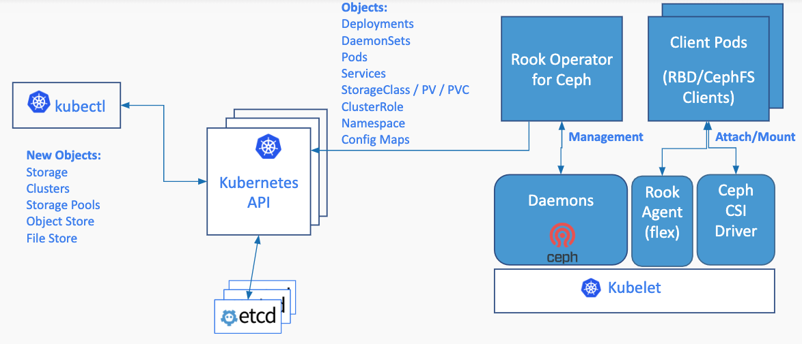

# Rook架构设计
`Rook`使`Ceph`存储系统能够使用`Kubernetes`原生资源对象在`Kubernetes`上运行。
下图说明了`Ceph Rook`如何与`Kubernetes`集成：

通过在`Kubernetes`集群中运行`Ceph`，`Kubernetes`应用可以挂载`Rook`管理的块设备和文件系统，
或者可以使用`S3/swiftapi`进行对象存储。
`Rook operator`自动配置存储组件并监视集群，以确保存储保持可用和正常。

`Rook operator`是一个简单的容器，它拥有引导和监视存储集群所需的所有东西。
`operator`将启动和监控`Ceph monitor pods`, `Ceph OSD`守护进程提供`RADOS`存储，以及启动和管理其他`Ceph`守护进程。
`operator`通过初始化运行服务所需的`pods`和其他组件来管理池、对象存储(S3/Swift)和文件系统的`crd`。

`operator`将监视存储守护程序，以确保群集正常运行。`Ceph-mons`将在必要时启动或故障转移，
并随着集群的增长或收缩进行其他调整。`operator`还将监视`api`服务请求的所需状态更改，并应用更改。

`Rook operator`还初始化消耗存储所需的代理。`Rook`会自动配置`Ceph CSI`驱动程序，将存储装载到`pod`中。

`rook/ceph`镜像包括管理集群所需的所有工具。许多`Ceph`概念，如放置组和`crush map`是隐藏的。
`Rook`在物理资源、池、卷、文件系统和存储桶方面为管理员创建了一个非常简化的用户体验。同时，当需要`Ceph`工具时，可以应用高级配置

`Rook`基于`golang`实现。`Ceph`是基于`C++`中实现的，其中数据路径是高度优化的。二者是最好的组合。              

# 使用Rook管理ceph
## 先决条件
### ceph先决条件

要配置`Ceph`存储群集，至少需要以下一个本地存储选项：

- 原始设备（没有分区或格式化的文件系统）
- 原始分区（无格式化文件系统）
- `k8s`存储类提供的块模式`PV`

### LVM包

在以下场景中，`Ceph OSD`依赖于`LVM`：

- `OSD`是在原始设备或分区上创建的
- 如果启用了加密（encryptedDevice: true）
- 指定了元数据设备

在以下情况下，`OSD`不需要`LVM`：
- 使用`storageClassDeviceSets`在`PVC`上创建`OSD`

如果您的场景需要`LVM`，那么`LVM`需要在运行`OSD`的主机上可用。有些`Linux`发行版不附带`lvm2`包。
要运行`Ceph OSDs`，`k8s`群集中的所有存储节点上都需要此包。如果没有这个包，即使`Rook`能够成功地创建`Ceph OSD`，当一个节点重新启动时，在重新启动的节点上运行的`OSD pods`将无法启动。请使用`Linux`发行版的包管理器安装`LVM`。例如：

CentOS:

    yum install -y lvm2
    
### 操作系统内核

#### RBD类型

`Ceph`需要一个用`RBD`模块构建的`Linux`内核。
许多`Linux`发行版都有这个模块，但不是所有发行版都有。例如，`GKE`容器优化`OS`（COS）没有`RBD`。

您可以通过运行`modprobe rbd`来测试`Kubernetes`节点。
如果它说'找不到'，你可能要重建你的内核或选择一个不同的`Linux`发行版。

#### cephfs类型

如果要从`Ceph`共享文件系统（CephFS）创建卷，建议的最低内核版本为`4.17`。

如果内核版本低于`4.17`，则不会强制执行所请求的`PVC`大小。存储配额将仅在较新的内核上强制执行。

## 准入控制器
   
准入控制器在对象持久化之前拦截到`Kubernetes API`服务器的请求，但在对请求进行身份验证和授权之后。

建议启用`Rook`允许控制器，以提供额外级别的验证，以确保`Rook`是使用自定义资源(CR)设置正确配置的。

### 快速开始

可利用助手脚本自动配置部署`Rook`准入控制器,这个脚本将帮助我们完成以下任务:

- 创建自签名证书
- 为证书创建证书签名请求（CSR），并从`Kubernetes`集群获得批准
- 将这些证书存储为`Kubernetes Secret`
- 创建`Service Account`、`ClusterRole`和`ClusterRoleBindings`，以便以最低权限运行`webhook`服务
- 创建`ValidatingWebhookConfig`并使用来自集群的适当值填充`CA bundle`

### 部署

> 下载配置文件上传至`k8s`节点`/root`下,解压

- [rook-1.5.8.tar.gz](https://github.com/rook/rook/archive/v1.5.8.tar.gz)

    
    tar zxvf rook-1.5.8.tar.gz
    
#### 创建CRD

    kubectl apply -f rook-1.5.8/cluster/examples/kubernetes/ceph/crds.yaml
    
#### 创建namespace、service accounts、RBAC rules

    kubectl apply -f rook-1.5.8/cluster/examples/kubernetes/ceph/common.yaml
    
#### 存储节点添加标签

    kubectl label nodes ceph01 role=storage-node
    kubectl label nodes ceph02 role=storage-node
    kubectl label nodes ceph03 role=storage-node
    
#### 安装rook operator

调整镜像地址

    # vim rook-1.5.8/cluster/examples/kubernetes/ceph/operator.yaml
    image: rook/ceph:v1.5.8
    # ROOK_CSI_CEPH_IMAGE: "quay.io/cephcsi/cephcsi:v3.2.0"
    # ROOK_CSI_REGISTRAR_IMAGE: "k8s.gcr.io/sig-storage/csi-node-driver-registrar:v2.0.1"
    # ROOK_CSI_RESIZER_IMAGE: "k8s.gcr.io/sig-storage/csi-resizer:v1.0.0"
    # ROOK_CSI_PROVISIONER_IMAGE: "k8s.gcr.io/sig-storage/csi-provisioner:v2.0.0"
    # ROOK_CSI_SNAPSHOTTER_IMAGE: "k8s.gcr.io/sig-storage/csi-snapshotter:v3.0.0"
    # ROOK_CSI_ATTACHER_IMAGE: "k8s.gcr.io/sig-storage/csi-attacher:v3.0.0"
    
发布

    kubectl apply -f rook-1.5.8/cluster/examples/kubernetes/ceph/operator.yaml

#### 调整ceph集群配置

`rook-1.5.8/cluster/examples/kubernetes/ceph/cluster.yaml`

[配置解析：](https://github.com/rook/rook/blob/master/Documentation/ceph-cluster-crd.md#storage-selection-settings)

- `metadata.namespace: rook-ceph` 默认即可
- `spec.cephVersion` `ceph`版本
    - `image: ceph/ceph:v15.2.9` 调整为实际可访问地址
- `spec.dataDirHostPath: /var/lib/rook` 主机存放`ceph`配置文件目录，重装需要清空该目录
- `spec.skipUpgradeChecks: false` 离线环境下设置为`true`关闭更新检测
- `spec.mon.num: 3` `ceph mons` 数量，建议使用默认值（如需调整必须为奇数）
- `spec.network:` 集群网络配置
- `spec.placement` `ceph`服务调度亲和性，建议配置如下

    ...
      placement:
        all:
          nodeAffinity:
            requiredDuringSchedulingIgnoredDuringExecution:
              nodeSelectorTerms:
              - matchExpressions:
                - key: role
                  operator: In
                  values:
                  - storage-node
          podAffinity:
          podAntiAffinity:
          topologySpreadConstraints:
          tolerations:
          - key: storage-node
            operator: Exists
    ...

- `spec.resources:` 资源配额，建议配置如下：

      resources:
    # The requests and limits set here, allow the mgr pod to use half of one CPU core and 1 gigabyte of memory
        mgr:
          limits:
            cpu: "500m"
            memory: "1024Mi"
          requests:
            cpu: "500m"
            memory: "1024Mi"
    # The above example requests/limits can also be added to the mon and osd components
        mon:
          limits:
            cpu: "2"
            memory: "4096Mi"
          requests:
            cpu: "500m"
            memory: "1024Mi"
        osd:
          limits:
            cpu: "2"
            memory: "8192Mi"
          requests:
            cpu: "1"
            memory: "1024Mi"
        mds:
          limits:
            cpu: "4"
            memory: "8192Mi"
          requests:
            cpu: "1"
            memory: "1024Mi"
            
- `spec.storage: `配置存储，建议按节点配置

      storage: # cluster level storage configuration and selection
        useAllNodes: false
        useAllDevices: false
        #deviceFilter:
        config:
        nodes:
        - name: "192.168.1.69"
          devices:
          - name: "sda"
          - name: "sdc"
          - name: "sdd"
          - name: "sde"
          - name: "sdf"
          - name: "sdg"
          - name: "sdh"
          - name: "nvme0n1"
          - name: "nvme1n1"
          - name: "nvme2n1"
          - name: "nvme3n1"
        - name: "192.168.1.70"
          devices:
          - name: "sda"
          - name: "sdb"
          - name: "sdd"
          - name: "sde"
          - name: "sdf"
          - name: "nvme0n1"
          - name: "nvme1n1"
          - name: "nvme2n1"
          - name: "nvme3n1"
        - name: "192.168.1.71"
          devices:
          - name: "sdb"
          - name: "sdc"
          - name: "sdd"
          - name: "sde"
          - name: "sdf"
          - name: "nvme0n1"
          - name: "nvme1n1"
          - name: "nvme2n1"
          - name: "nvme3n1"
          
**其他配置使用默认值**

> 创建集群

    kubectl apply -f rook-1.5.8/cluster/examples/kubernetes/ceph/cluster.yaml
    
> 查看状态

查看`pod`

    [root@ceph01 ceph]# kubectl get pod -n rook-ceph
    NAME                                           READY   STATUS    RESTARTS   AGE
    csi-cephfsplugin-bxsfm                         3/3     Running   0          14s
    csi-cephfsplugin-provisioner-7d8f9765f-hkhj9   6/6     Running   0          13s
    csi-cephfsplugin-provisioner-7d8f9765f-pwwvn   6/6     Running   0          13s
    csi-cephfsplugin-v92l2                         3/3     Running   0          14s
    csi-rbdplugin-dwftm                            3/3     Running   0          15s
    csi-rbdplugin-provisioner-669cc846cb-kfkzc     6/6     Running   0          14s
    csi-rbdplugin-provisioner-669cc846cb-rpp2r     6/6     Running   0          14s
    csi-rbdplugin-rfxc6                            3/3     Running   0          15s
    rook-ceph-operator-85bd8c8f64-gk2gz            1/1     Running   0          6m28s
  
查看集群状态

    kubectl -n rook-ceph get CephCluster -o yaml
    
> 