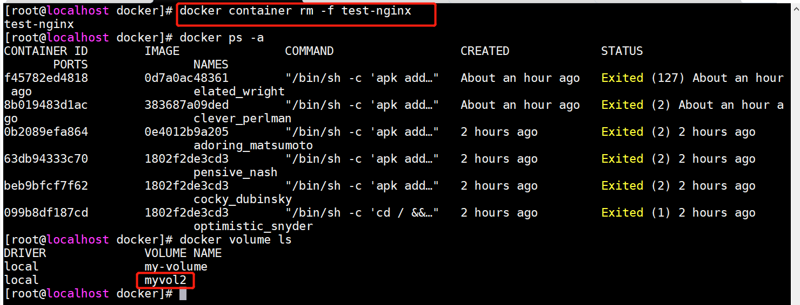

## 网络模型 ##

`bridge` 

`host`

`overlay`

## 存储类型 ##

`volums`

`Bind volums`

``

## 数据持久 ##

**几种数据持久方案区别**

volume：对宿主机文件系统之上的 容器可写入层 进行读写操作

Bind mounts：宿主机与容器以映射的方式共享目录，对宿主机文件系统进行读写操作

tmpfs：数据存储于内存中，不持久化

### volums ###

Volumes方式的数据存储于docker宿主机的/var/lib/docker/volumes/下（Linux系统下），由于linux严格的权限管理，非docker进程无法修改该目录下数据，具有很好的隔离性，volums为目前最好的docker容器数据持久化的方式。

> 管理方式

	由docker进行创建管理，创建方式为两种：

	1、手动创建
	docker volume create

	2、自动创建
	随容器/服务的创建而被创建

> 使用场景

	1、多容器运行时共享数据

	2、当Docker主机不能保证具有给定的目录或文件结构时。卷可以帮助您将Docker主机的配置与容器运行时解耦。（例如A环境具有/data目录，当迁移至B环境不具有/data目录）

	3、存储容器数据于远程主机

	4、备份、迁移容器数据等至远程主机，备份目录
	/var/lib/docker/volumes/<volume-name>

> 管理volume

	#1、手动创建
	docker volume create my-volume
	
	#查看volume
	docker inspect my-volume

	#2、创建启动容器时指定volume
	docker run -d --name test-nginx --mount source=myvol2,target=/app nginx:latest

	#查看volume列表(默认在创建启动容器时自动创建了myvol2)
	docker volume ls

	#接下来，测试删除容器后volume是否会随之被删除(很显然删除容器对volume并未产生影响，需手动删除)

	#手动删除volume

> volume指定为只读方式

	#创建启动容器，指定volumew名为nginx-vol（实际路径为/var/lib/docker/volumes/nginx-vol），对应容器内/usr/share/nginx/html目录，并且为只读状态（容器内禁止写操作）
	docker run -d --name=nginxtest --mount source=nginx-vol,destination=/usr/share/nginx/html,readonly nginx:latest

	#查看本地volume情况(nginx容器内的数据已挂载出来)

	#访问容器内，验证可读属性（）
	docker container exec -it nginxtest bash
	cd /usr/share/nginx/html
	echo 1 >> 50x.html

	

### Bind mounts ###

Bind mounts方式理论上可以在宿主机任意位置持久化数据，显然非docker进程可以修改这部分数据，隔离性较差。

> 使用场景

	1、容器与宿主机共享配置文件等（如dns、时区等）

	2、共享源代码或打包后的应用程序（例如：宿主机maven打包java程序，只需挂载target/目录，容器内即可访问到打包好的应用程序）
	当然，该方式仅适用于开发环境，安全考虑并不推荐使用于生产环境

	3、Docker主机的文件或目录结构与容器所需的绑定挂载一致时。（例如容器内读取配置文件目录为/etc/redis.conf,而宿主机/etc/redis.conf并不存在，则需要匹配路径进行挂载）

### volums与Bind mounts对比 ###

1. Volumes方式更容易备份、迁移

2. Volumes可以通过docker命令行指令或api进行管理

3. Volumes适用于windows与linux环境

4. Volumes多容器分享数据更安全（非docker进程无法修改该部分数据）

5. Volume drivers可以实现加密传输数据持久化至远程主机。

6. 新volume的内容可以由容器预先填充

### 关于volums与Bind mounts使用说明 ###

1. 如果你挂载一个空的volums到容器的/data目录，并且容器内/data下数据非空，则容器内的/data数据会拷贝到新挂载的卷上；相似的，如果你挂载了宿主机不存在的volums至容器内部，这个不存在的目录则会自动创建

2. 如果你使用bind mount或挂载一个非空的volum到容器的/data目录，并且容器内/data下数据非空，则容器内的/data部分数据会被覆盖（相同目录/文件名）

### tmpfs ###

tmpfs方式数据存储宿主机系统内存中，并且不会持久化到宿主机的文件系统中（磁盘）

> 使用场景

	存储敏感数据（swarm利用tmpfs存放secrets于内存中）

### 磁盘占用 ###

