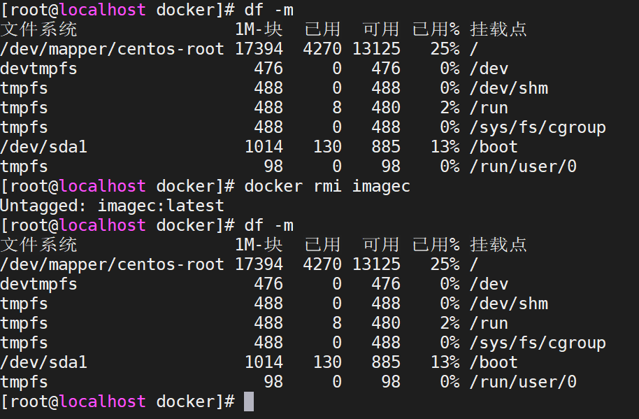
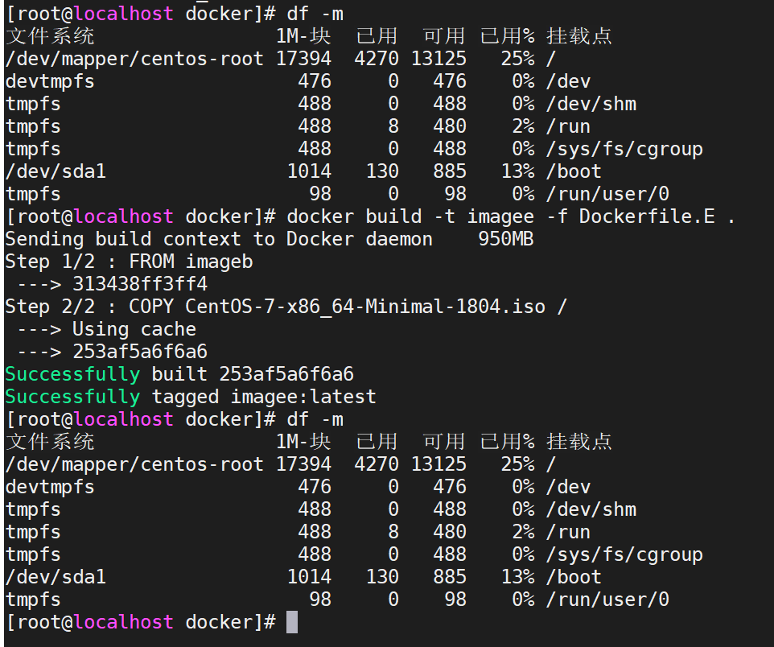
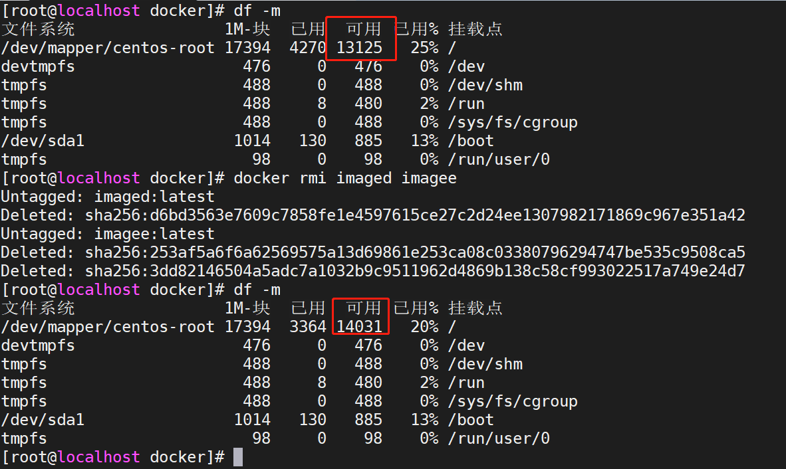

## 安装docker ##

`适用于CentOS7&Red Hat 7`

> 查看操作系统版本与内核

	#内核要求3.1以上

> 下载docker安装包

	#互联网下载地址
	https://download.docker.com/linux/static/stable/x86_64/docker-19.03.1.tgz

> 上传安装

	#上传至/tmp下，root用户安装
	cd /tmp && tar -xvf docker-19.03.1.tgz && cp docker/* /usr/bin/

> 关闭selinux

	setenforce 0
	sed -i "s#SELINUX=enforcing#SELINUX=disabled#g" /etc/selinux/config

> 配置为系统服务

	cat >/etc/systemd/system/docker.service <<EOF
	[Unit]

	Description=Docker Application Container Engine
	
	Documentation=https://docs.docker.com
	
	After=network-online.target firewalld.service
	
	Wants=network-online.target
	
	[Service]
	
	Type=notify
	
	# the default is not to use systemd for cgroups because the delegate issues still
	
	# exists and systemd currently does not support the cgroup feature set required
	
	# for containers run by docker
	
	ExecStart=/usr/bin/dockerd
	
	ExecReload=/bin/kill -s HUP 
	
	# Having non-zero Limit*s causes performance problems due to accounting overhead
	
	# in the kernel. We recommend using cgroups to do container-local accounting.
	
	LimitNOFILE=infinity
	
	LimitNPROC=infinity
	
	LimitCORE=infinity
	
	# Uncomment TasksMax if your systemd version supports it.
	
	# Only systemd 226 and above support this version.
	
	#TasksMax=infinity
	
	TimeoutStartSec=0
	
	# set delegate yes so that systemd does not reset the cgroups of docker containers
	
	Delegate=yes
	
	# kill only the docker process, not all processes in the cgroup
	
	KillMode=process
	
	# restart the docker process if it exits prematurely
	
	Restart=on-failure
	
	StartLimitBurst=3
	
	StartLimitInterval=60s
	
	
	
	[Install]
	
	WantedBy=multi-user.target
	EOF

> 启动并设置为开机自启动

	#重载unit配置文件
	systemctl daemon-reload                                                       

	#启动Docker
	systemctl start docker                                                            
	
	#设置开机自启
	systemctl enable docker.service 

> 查看docker状态

	docker --version
	systemctl status docker

  

### 管理docker ###

> 配置代理

	#适用场景：内网访问互联网docker镜像仓库
	mkdir -p /etc/systemd/system/docker.service.d

	cat > /etc/systemd/system/docker.service.d/http-proxy.conf <<EOF
	[Service]
	Environment="HTTP_PROXY=http://xxx.xxx.xxx.xxx:xxxx"
	EOF

	systemctl daemon-reload && systemctl restart docker

> 配置阿里云加速

	#参考地址
	https://cr.console.aliyun.com/cn-hangzhou/instances/mirrors

	sudo mkdir -p /etc/docker
	sudo tee /etc/docker/daemon.json <<-'EOF'
	{
	  "registry-mirrors": ["https://jz73200c.mirror.aliyuncs.com"]
	}
	EOF
	sudo systemctl daemon-reload
	sudo systemctl restart docker   

> 下载镜像

`docker pull`

	docker pull docker.elastic.co/elasticsearch/elasticsearch:7.3.0

> 查看本地镜像
 
`docker images`

	docker images

> 持久化镜像至本地磁盘

`docker save -o 目标目录/镜像文件名称 本地镜像:镜像tag值`

	docker save -o /root/elasticsearch-7.3.0.tar docker.elastic.co/elasticsearch/elasticsearch:7.3.0

## 安装docker-compose ##

> 下载

	sudo curl -L "https://github.com/docker/compose/releases/download/1.24.1/docker-compose-$(uname -s)-$(uname -m)" -o /usr/local/bin/docker-compose

> 授权

	chmod +x /usr/local/bin/docker-compose

> 查看docker-compose

	#查看版本信息
	docker-compose --version

### 存储驱动 ###

**以下内容基于**`overlay2`

`overlay2`为docker存储驱动的一种，负责容器读写（不会修改镜像原始数据）镜像数据

#### 可写入层 ####

`writable layer`

官方文档描述如下：

	When you start a container, a thin writable container layer is added on top of the other layers. 
	Any changes the container makes to the filesystem are stored here. 
	Any files the container does not change do not get copied to this writable layer. 
	This means that the writable layer is as small as possible.

假设现在有镜像A，B构建文件如下

	#A镜像构建文件（构建镜像名为：imageA，拷贝内容为hello.sh、app.py）
	FROM ubuntu:18.04
	COPY ./hello.py ./hello.sh /app/
	CMD python /app/app.py

	#B镜像构建文件（构建镜像名为：imageB）
	FROM imageB
	CMD /bin/bash /app/hello.sh

	#hello.sh内容
	#!/bin/sh
	echo "Hello world"

	#hello.py内容
	print('hello python!')

目录结构及文件内容如下

构建镜像ab

	docker build -t imagea -f Dockerfile.A .
	docker build -t imageb -f Dockerfile.B .

查看两者层级

	
很显然，A镜像红框内的3个层级分别由以下构建命令生成，其他层级由基础镜像ubuntu:18.04生成

	FROM ubuntu:18.04
	COPY ./hello.py ./hello.sh /app/
	CMD python /app/app.py

而B镜像对比A镜像之多出一个层级313438ff3ff4，即以下构建指令生成的层，该层即为可写入层，镜像B与镜像A的区别存储于该层
而镜像B与镜像A相同的层级指向同一系统存储地址，
由于该层仅为一条shell指令故大小可以忽略不计，即构建B镜像理论上对宿主机磁盘的占用忽略不计，由此可看见docker的分层结构相当节省存储空间

`Any changes the container makes to the filesystem are stored here`

	CMD /bin/bash /app/hello.sh

**测试以上结论是否正确**

构建镜像CD，配置文件内容为如下：

	#Dockerfile.C
	FROM imageb
	COPY CentOS-7-x86_64-Minimal-1804.iso /

	#Dockerfile.D
	FROM imagec
	CMD /bin/bash /app/hello.py

**此时磁盘空间大小**

文件大小为906M，理论上构建CD镜像后，磁盘剩余空间在14031-906=13125M左右

	docker build -t imagec -f Dockerfile.C .
	docker build -t imaged -f Dockerfile.D .

很显然测试结果验证了以上的结论（当然官方已经说明了，这里仅仅是测试而已），我们再看下镜像cd的层级

**测试删除镜像C，对磁盘空间有何影响**

分析：由于镜像C与镜像D有相同分层，且镜像D比镜像C多一个层级，即可以理解为D内数据包含C数据，删除镜像C对宿主机磁盘空间无任何影响

由此可见，验证了我们的猜测：删除镜像C对宿主机磁盘空间无任何影响（存在镜像D包含镜像C所有数据内容）

**测试生成镜像E，构建内容为镜像C的内容，宿主机磁盘空间是否变化。**

分析：因为E的所有数据内容都已存在（镜像D持有），故磁盘空间不会发生变化

	#Dockerfile.E
	FROM imageb
	COPY CentOS-7-x86_64-Minimal-1804.iso /

	docker build -t imagee -f Dockerfile.E .

显然猜测成立

**测试删除镜像D、E，对磁盘空间有何影响**

分析：由于镜像C、镜像D、镜像E均持有`COPY CentOS-7-x86_64-Minimal-1804.iso /`层级，镜像C已经删除，此时再删除镜像D、镜像E，
`COPY CentOS-7-x86_64-Minimal-1804.iso /`层级无其他镜像引用，导致磁盘空间释放906M

猜测成立！

**结论如下：**

- docker分层架构在很大程度上节省了磁盘存储开销（镜像文件一般较大），相同层级只存储一份

- 删除镜像时，只会删除与其他镜像`非同层级数据`

`copy-on-write`

#### 写时拷贝 ####

官方对Copy-on-write的说明:

	Copy-on-write is a strategy of sharing and copying files for maximum efficiency. If a file or directory exists in a lower layer within the image, and another layer (including the writable layer) needs read access to it, it just uses the existing file. The first time another layer needs to modify the file (when building the image or running the container), the file is copied into that layer and modified. This minimizes I/O and the size of each of the subsequent layers. These advantages are explained in more depth below

	总结为：容器需要读写底层（镜像的层级）数据时，会将文件或目录拷贝到容器`可写层`进行读写，而非全部拷贝（显然镜像的某些层级包含的文件在容器整个运行周期中可能并不会用到）。

**测试写时拷贝**

	#构建镜像F
	#Dockerfile.F
	FROM centos
	COPY CentOS-7-x86_64-Minimal-1804.iso /

	docker build -t imagef -f Dockerfile.F .

分析：运行时并未读写其他层级数据，容器大小忽略不计

	

官方对Copy-on-write优势的说明:

	Not only does copy-on-write save space, but it also reduces start-up time.
	When you start a container (or multiple containers from the same image), Docker only needs to create the thin writable container layer

	总结：节省存储空间、容器启动快

#### overlay2 ####

`overlay2`可理解为连接`container (upperdir)`与`image (lowerdir)`的纽带，类比显卡驱动等

> 容器读取文件

官方列举三个场景

	The file does not exist in the container layer: 
	If a container opens a file for read access and the file does not already exist in the container (upperdir) it is read from the image (lowerdir). 
	This incurs very little performance overhead.

	#如果容器层不存在该文件，将从镜像层读取，官方表示性能损耗较小。

	The file only exists in the container layer:
	If a container opens a file for read access and the file exists in the container (upperdir) and not in the image (lowerdir), 
	it is read directly from the container.

	#如果容器层存在该文件，将直接从容器层读取
	
	The file exists in both the container layer and the image layer: 
	If a container opens a file for read access and the file exists in the image layer and the container layer, 
	the file’s version in the container layer is read. 
	Files in the container layer (upperdir) obscure files with the same name in the image layer (lowerdir).

	#如果容器层、镜像层均存在该文件，优先读取容器层文件的版本

> 容器修改文件|目录

官方列举几个场景：

	Writing to a file for the first time: 
	The first time a container writes to an existing file, that file does not exist in the container (upperdir). 
	The overlay/overlay2 driver performs a copy_up operation to copy the file from the image (lowerdir) to the container (upperdir). 
	The container then writes the changes to the new copy of the file in the container layer.

	#第一次修改容器层不存在的文件时，overlay驱动执行`copy_up`操作，将文件从镜像层拷贝到容器层，然后容器将"更改"写入容器层中文件的新副本

	However, OverlayFS works at the file level rather than the block level. 
	This means that all OverlayFS copy_up operations copy the entire file, even if the file is very large and only a small part of it is being modified. This can have a noticeable impact on container write performance. However, two things are worth noting:

	1、The copy_up operation only occurs the first time a given file is written to. 
	Subsequent writes to the same file operate against the copy of the file already copied up to the container.

	2、OverlayFS only works with two layers.
	This means that performance should be better than AUFS, which can suffer noticeable latencies when searching for files in images with many layers.
    This advantage applies to both overlay and overlay2 drivers. overlayfs2 is slightly less performant than overlayfs on initial read, 
	because it must look through more layers, but it caches the results so this is only a small penalty.

	#只有第一次文件拷贝为全量拷贝，以后读写操作均操作容器层上的文件副本

	Deleting files and directories:

	1、When a file is deleted within a container, a whiteout file is created in the container (upperdir). 
	The version of the file in the image layer (lowerdir) is not deleted (because the lowerdir is read-only).
    However, the whiteout file prevents it from being available to the container.

	2、When a directory is deleted within a container, an opaque directory is created within the container (upperdir). 
    This works in the same way as a whiteout file and effectively prevents the directory from being accessed, 
    even though it still exists in the image (lowerdir).

	#当删除容器内的某一文件（假如/usr/bin/telnet）或目录（/boot）时，对应镜像层的文件不会被删除（只读性），虽然镜像层依然存在该文件，但容器层已服务对其进行读写

	Renaming directories: 
	Calling rename(2) for a directory is allowed only when both the source and the destination path are on the top layer. 
	Otherwise, it returns EXDEV error (“cross-device link not permitted”).
    Your application needs to be designed to handle EXDEV and fall back to a “copy and unlink” strategy.

	#重命名容器内目录

	

		

	
	
	