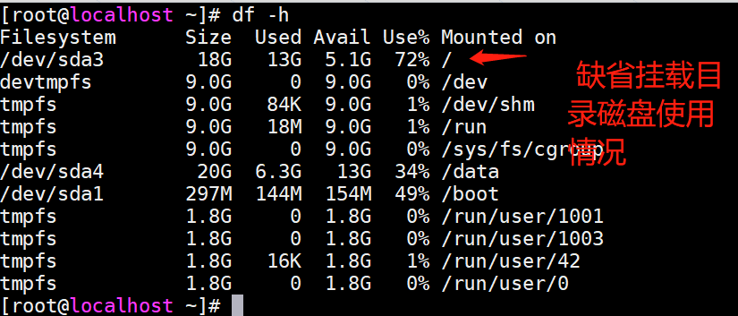

## 常用命令 ##

### 系统信息 ###

> 0.查看系统版本

	cat /etc/system-release
    uname -a

> 1.查看红帽系统主版本号

**适用于红帽系列系统**

	cat /etc/redhat-release|sed -r 's/.* ([0-9]+)\..*/\1/'

> 2.查看内存
	
	#单位为g
	free -h
	#单位为m
	free -m

> 3.查看磁盘

	df -h

> 4.查看文件大小

	du -h 文件名

> 5.查看CPU

	lscpu

> 6.查看系统最大文件打开数

	ulimit -n

## yum配置 ##

`CentOS` `yum`

### 阿里yum源 ###

**适用于**

`主机可以直连外网、或可以通过代理访问外网`

> 1、查看操作系统

	cat /etc/system-release

> 2、下载阿里yum源文件

	CentOS 5
	http://mirrors.aliyun.com/repo/Centos-5.repo

	CentOS 6
	http://mirrors.aliyun.com/repo/Centos-6.repo

	CentOS 7
	http://mirrors.aliyun.com/repo/Centos-7.repo

> 3、删除原有yum源repo文件

	cd /etc/yum.repos.d && rm -f *.repo

> 4、上传阿里yum源文件

	#选取对应版本的操作系统repo文件，上传至以下目录
	/etc/yum.repos.d

> 5、测试网络连通性

	ping 114.114.114.114
	ping mirrors.aliyun.com

	#情况一：ping通ip ping不通域名，执行以下命令添加DNS
	echo "nameserver 114.114.114.114" >> /etc/resolv.conf

	#情况二：ping不通ip ping不通域名，如果是外网机器，说明没有网络权限，需要申请/开通以下权限

	外网主机x.x.x.x 需要访问以下地址：
	mirrors.aliyun.com
	mirrors.aliyuncs.com
	mirrors.cloud.aliyuncs.com

	#情况三：ping不通ip ping不通域名，如果是内网机器，如果有代理（假设外网squid代理）且能访问，执行以下命令，注意IP、端口进行替换
	echo "proxy=http://127.0.0.1:3128" >> /etc/yum.conf

> 6、测试

	yum clean all && yum makecache
	yum install -y telnet vim
	
### 本地yumy源 ###

**适用于**

`主机不可以直连外网、且不可以通过代理访问外网`

> 1、查看操作系统

	cat /etc/system-release

> 2、获取系统安装镜像

	#DVD版或Everything版本

	#1、获取方式一：找系统运维管理员提供，推荐
	让系统管理员帮挂载到/media 或 上传至 /root下

	#2、获取方式二：自己下载，不推荐，文件大小一般4G左右，小版本一定要匹配！
	官方下载地址：https://wiki.centos.org/Download

> 3、上传挂载

	#注意路径、文件名需要替换，以下命令相当于将CentOS-7-x86_64-DVD-1511.iso，解压到/media
	mount -o loop ~/CentOS-7-x86_64-DVD-1511.iso /media

> 4、卸载、拷贝、删除

	mkdir -p /yum && cp -r /media/* /yum/
	unmout /media

> 5、删除原有yum源repo文件

	cd /etc/yum.repos.d && rm -f *.repo

> 6、新建yum repo文件

	cat >> /etc/yum.repos.d/c7.repo <<EOF
	[c7repo]
	
	name=c7repo
	
	baseurl=file:///yum
	
	enabled=1
	
	gpgcheck=0
	
	gpgkey=file:///etc/pki/rpm-gpg/RPM-GPG-KEY-CentOS-7
	EOF

> 7、测试

	yum clean all && yum makecache
	yum install -y telnet vim

## 防火墙配置 ##

### linux6 ###

**适用于`CentOS6 RedHat6`**

> 1.防火墙开放端口

	#开放端口（7777）
	iptables -I INPUT -p tcp -m state --state NEW -m tcp --dport 7777 -j ACCEPT
    #保存
    /etc/rc.d/init.d/iptables save
    #重载
    service iptables restart

> 2.关闭防火墙

**如果仅仅是为了开放端口，建议采用【1.防火墙开放端口】**

	#临时关闭防火墙服务，并关闭防火墙开机自启动
	service iptables stop
	chkconfig iptables off

> 3.开启防火墙

	#开启防火墙服务，并设置防火墙开机自启动
	service iptables start
	chkconfig iptables on

### linux7 ###

**适用于`CentOS6 RedHat7`**

> 1.防火墙开放端口

	firewall-cmd --zone=public --add-port=7777/tcp --permanent
	#重新载入
	firewall-cmd --reload

> 2.关闭防火墙

**如果仅仅是为了开放端口，建议采用【1.防火墙开放端口】**

	#临时关闭防火墙服务，并关闭防火墙开机自启动
	systemctl stop firewalld.service
	systemctl disable firewalld.service

> 3.开启防火墙

	#开启防火墙服务，并设置防火墙开机自启动
	systemctl start firewalld.service
	systemctl enable firewalld.service

## 系统漏洞修复 ##

### openssh漏洞 ###

[原文地址](https://blog.csdn.net/hongdeng123/article/details/86267368)

``

> 1、查看系统ssh版本

> 2、下载最新openssh,上传至/root下

	https://cdn.openbsd.org/pub/OpenBSD/OpenSSH/portable/

> 3、安装telnet

避免ssh无法登录

	yum -y install telnet-server* zlib-devel

> 4、关闭防火墙，更改配置

	service iptables stop
	chkconfig iptables off
	sed -i 's#disable         = yes#disable         = no#g' /etc/xinetd.d/telnet

	mv /etc/securetty /etc/securetty.old    #允许root用户通过telnet登录
	service xinetd start                    #启动telnet服务
	chkconfig xinetd on                     #使telnet服务开机启动，避免升级过程中服务器意外重启后无法远程登录系统
	telnet [ip]                             #新开启一个远程终端以telnet登录验证是否成功启用

> 5、检查环境

官方给出的文档中提到的先决条件openssh安装依赖zlib1.1.4并且openssl>=1.0.1版本就可以了。

	openssl version
	rpm -q zlib
	rpm -q zlib-devel

> 6、安装依赖，卸载旧版本openssh

	yum install -y gcc openssl-devel pam-devel rpm-build pam-devel
	rpm -e `rpm -qa | grep openssh` --nodep

> 7、编译新的openssh

版本号注意替换

	tar zxvf openssh-8.0p1.tar.gz
	cd openssh-8.0p1
	./configure --prefix=/usr --sysconfdir=/etc/ssh --with-pam --with-zlib --with-md5-passwords --with-tcp-wrappers && make && make install
	sed -i 's/#PermitRootLogin prohibit-password/PermitRootLogin\ yes/g' /etc/ssh/sshd_config #或手动修改PermitRootLogin no 修改为 PermitRootLogin yes 允许root远程登陆
	sed -i 's/#PermitEmptyPasswords\(.*\)/PermitEmptyPasswords\ no/g' /etc/ssh/sshd_config  ##禁止空密码
	sed -i 's/^SELINUX\(.*\)/SELINUX=disabled/g' /etc/selinux/config  ##重点来了～～～禁止selinux 否则重启后会登录失败
	echo 'KexAlgorithms curve25519-sha256@libssh.org,ecdh-sha2-nistp256,ecdh-sha2-nistp384,ecdh-sha2-nistp521,diffie-hellman-group-exchange-sha256,diffie-hellman-group14-sha1,diffie-hellman-group-exchange-sha1,diffie-hellman-group1-sha1' >> /etc/ssh/sshd_config ## 写上新版ssh支持的算法
	cp contrib/redhat/sshd.init /etc/init.d/sshd
	chkconfig --add sshd
	chkconfig sshd on
	service sshd start
	service sshd restart
	chkconfig --list sshd
	ssh -V

> 8、关闭telnet开启防火墙

	mv /etc/securetty.old /etc/securetty   #允许root用户通过telnet登录
	service xinetd stop
	chkconfig xinetd off
	service iptables start
	chkconfig iptables on
	sed -i 's#disable         = no#disable         = yes#g' /etc/xinetd.d/telnet

### 探测到SSH服务器支持的算法 ###

描述：本插件用来获取SSH服务器支持的算法列表

处理：无法处理。ssh协议协商过程就是服务端要返回其支持的算法列表。

### ICMP timestamp请求响应漏洞 ###

描述：远程主机会回复ICMP_TIMESTAMP查询并返回它们系统的当前时间。 这可能允许攻击者攻击一些基于时间认证的协议。

处理：调整防火墙规则

	iptables -I INPUT -p ICMP --icmp-type timestamp-request -m comment --comment "deny ICMP timestamp" -j DROP
	iptables -I INPUT -p ICMP --icmp-type timestamp-reply -m comment --comment "deny ICMP timestamp" -j DROP

### 允许Traceroute探测 ###

描述：本插件使用Traceroute探测来获取扫描器与远程主机之间的路由信息。攻击者也可以利用这些信息来了解目标网络的网络拓扑。

处理：调整防火墙规则

	iptables -I INPUT -p icmp --icmp-type 11 -m comment --comment "deny traceroute" -j DROP

### FTP服务器版本信息可被获取(CVE-1999-0614)漏洞整改方法 ###

https://blog.csdn.net/zcb_data/article/details/80590909

### SSH版本信息可被获取漏洞解决方法 ###

https://blog.csdn.net/zcb_data/article/details/80499189

### SSH 支持弱加密算法漏洞 ###
https://blog.csdn.net/qq_40606798/article/details/86512610

	

	

