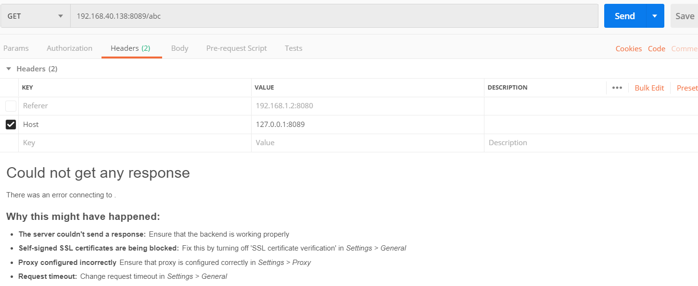

<!-- START doctoc generated TOC please keep comment here to allow auto update -->
<!-- DON'T EDIT THIS SECTION, INSTEAD RE-RUN doctoc TO UPDATE -->
**Table of Contents**  *generated with [DocToc](https://github.com/thlorenz/doctoc)*

- [keepalive及444状态码](#keepalive%E5%8F%8A444%E7%8A%B6%E6%80%81%E7%A0%81)

<!-- END doctoc generated TOC please keep comment here to allow auto update -->

## keepalive及444状态码 ##

**keepalive**

该配置官方文档给出的默认值为75s

[官方文档地址](http://nginx.org/en/docs/http/ngx_http_core_module.html#variables)

> 1、nginx keepalive配置方便起见配置为30s

	#配置于nginx.conf 中的 http{}内
	keepalive_timeout 30s;

> 2、nginx server配置

	server {
        listen 8089;
        location /123 {
                proxy_pass http://192.168.1.145:8080;
        }
        location / {
                index html/index.html;
        }
	}

> 3、开启wireshark监听虚拟网卡（nginx部署于本地vmware上的虚机，nat模式）

> 4、使用POSTMAN发送请求

> 5、wireshark过滤观察

keepalive与断开连接

**444状态码**

适用于屏蔽非安全请求或DDOS防御

> 1、nginx server配置

	server {
        listen 8089;
        location /123 {
                proxy_pass http://192.168.1.145:8080;
        }
        location / {
                index html/index.html;
        }

		location /abc {
                return 444;
        }
	}

> 2、开启wireshark监听虚拟网卡（nginx部署于本地vmware上的虚机，nat模式）

> 3、发送请求

> 4、wireshark过滤观察

