<!-- START doctoc generated TOC please keep comment here to allow auto update -->
<!-- DON'T EDIT THIS SECTION, INSTEAD RE-RUN doctoc TO UPDATE -->
**Table of Contents**  *generated with [DocToc](https://github.com/thlorenz/doctoc)*

- [磁盘阵列](#%E7%A3%81%E7%9B%98%E9%98%B5%E5%88%97)
- [oVirt安装](#ovirt%E5%AE%89%E8%A3%85)
- [添加存储](#%E6%B7%BB%E5%8A%A0%E5%AD%98%E5%82%A8)
- [添加主机](#%E6%B7%BB%E5%8A%A0%E4%B8%BB%E6%9C%BA)
- [添加存储域](#%E6%B7%BB%E5%8A%A0%E5%AD%98%E5%82%A8%E5%9F%9F)
- [创建iso域](#%E5%88%9B%E5%BB%BAiso%E5%9F%9F)
- [上传镜像](#%E4%B8%8A%E4%BC%A0%E9%95%9C%E5%83%8F)
- [新增虚机](#%E6%96%B0%E5%A2%9E%E8%99%9A%E6%9C%BA)

<!-- END doctoc generated TOC please keep comment here to allow auto update -->

## 磁盘阵列

先安装配置raid10,挂载路径/data

**根据磁盘数量创建阵列、推荐raid5**

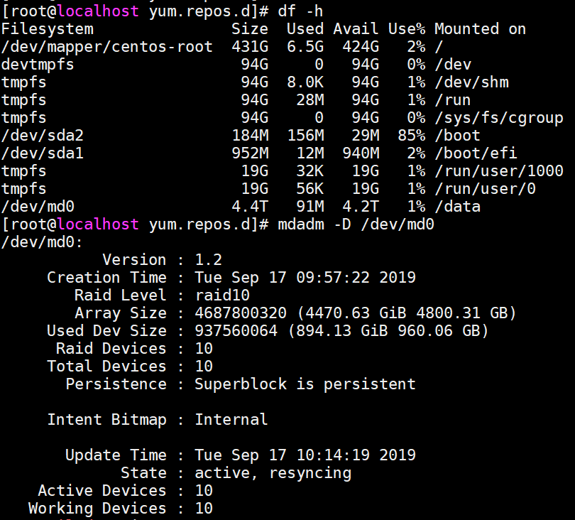

## oVirt安装

配置阿里yum源

关闭selinux
	
	setenforce 0
	sed -i "s#SELINUX=enforcing#SELINUX=disabled#g" /etc/selinux/config

安装

[ovirt-release42.rpm](http://resources.ovirt.org/pub/yum-repo/ovirt-release42.rpm)

	yum install -y ovirt-release42.rpm

修改ovirt-4.2.repo、ovirt-4.2-dependencies.repo

\#baseurl调整为baseurl 

mirrorlist调整为#mirrorlist

gpgcheck=1调整为gpgcheck=0

	sed -i 's#gpgcheck=1#gpgcheck=0#g' /etc/yum.repos.d/*.repo
	yum -y update --nogpgcheck
	yum install firewalld -y
	yum install -y ovirt-engine --nogpgcheck

启动

	systemctl start ovirt-engine
	systemctl enable ovirt-engine

配置

**确保80没被占用,或修改httpd服务端口**

[参考地址](https://blog.csdn.net/aydragon/article/details/80250599)

**需要开启防火墙，不然配置报错**

	engine-setup

	#默认配置
	#engine-setup --accept-defaults

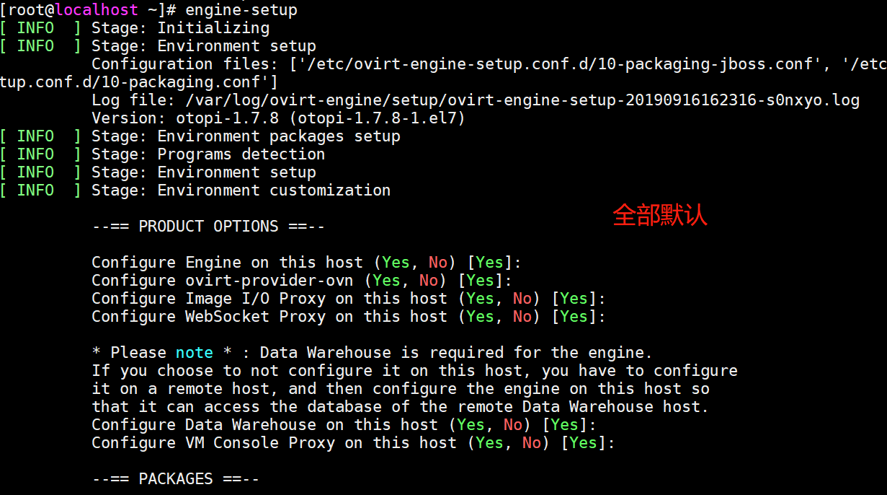

修改配置

	echo "SSO_CALLBACK_PREFIX_CHECK=false" > /etc/ovirt-engine/engine.conf.d/99-sso.conf
	
重启

	systemctl restart ovirt-engine

开放443端口

	firewall-cmd --zone=public --add-port=443/tcp --permanent
	#重新载入
	firewall-cmd --reload

登陆

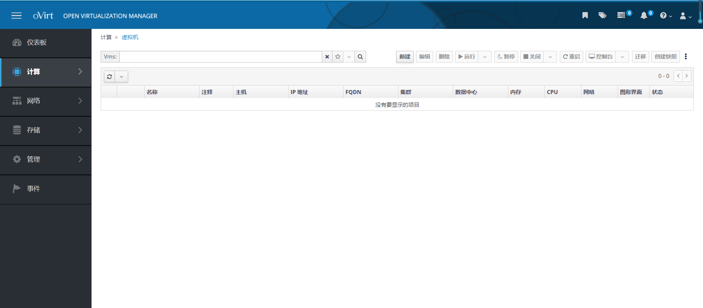

## 添加存储

计算 => 数据中心 => 新建

## 添加主机

关闭新建ssh连接确认

	sed -i "s;#   StrictHostKeyChecking ask;StrictHostKeyChecking no;g" /etc/ssh/ssh_config
	systemctl restart sshd

关闭yum公钥检测

**默认使用的时候没问题，通过ovirt使用提示校验公钥失败**

	sed -i 's#gpgcheck=1#gpgcheck=0#g' /etc/yum.repos.d/*.repo

新增主机

	计算 => 主机 => 新建

**点击确定前，确保目标主机yum可用，且关闭公钥检测**

查看部署日志

	tail -200f /var/log/ovirt-engine/engine.log

## 添加存储域

存储 => 存储域 => 新建

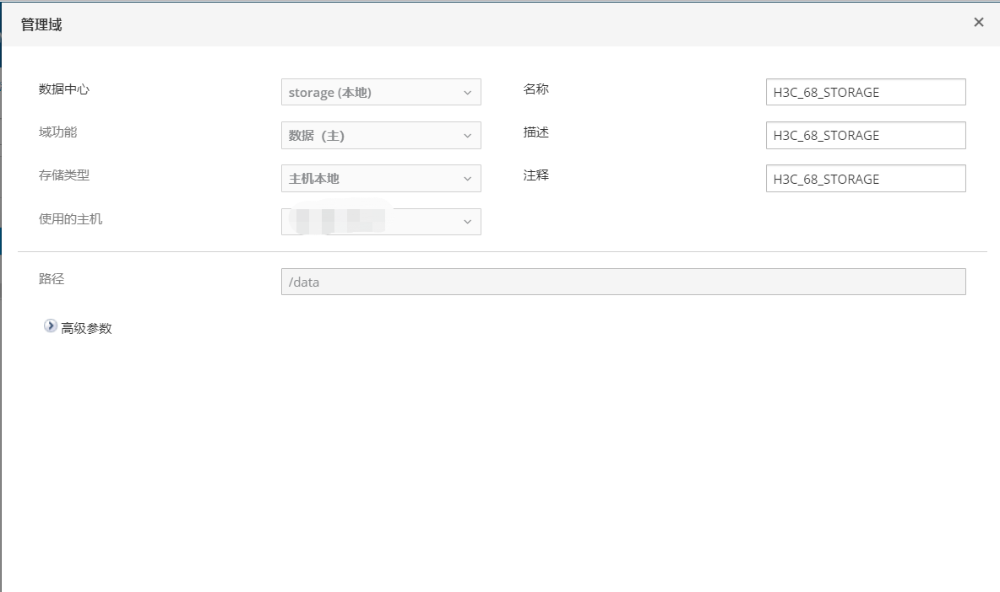

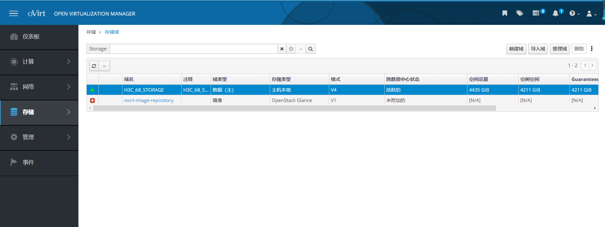

## 创建iso域

安装配置nfs

	yum install -y nfs-utils rpcbind
	systemctl daemon-reload
	systemctl enable rpcbind
	systemctl enable nfs-server
	systemctl start rpcbind
	systemctl start nfs-server
	mkdir -p /images
	echo "/images  192.168.0.0/16(rw)">>/etc/exports
	exportfs -a
	chmod 777 -R /images

[详细教程](https://blog.csdn.net/finalkof1983/article/details/80432028)

创建iso域

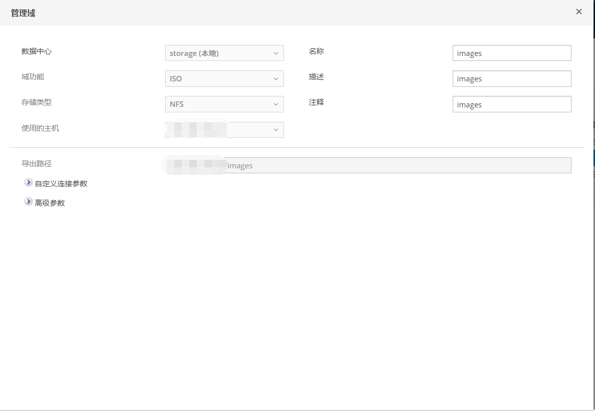

## 上传镜像

	ovirt-iso-uploader -v --iso-domain=images upload /root/CentOS-7-x86_64-Minimal-1810.iso

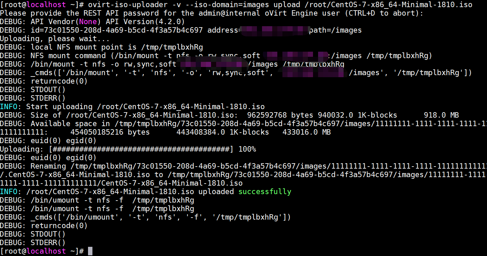

## 新增虚机

计算 -> 虚拟机 -> 新建

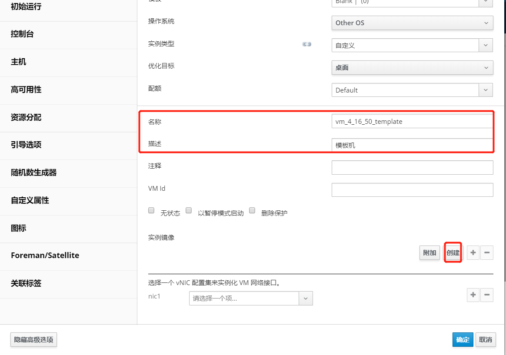

新增磁盘

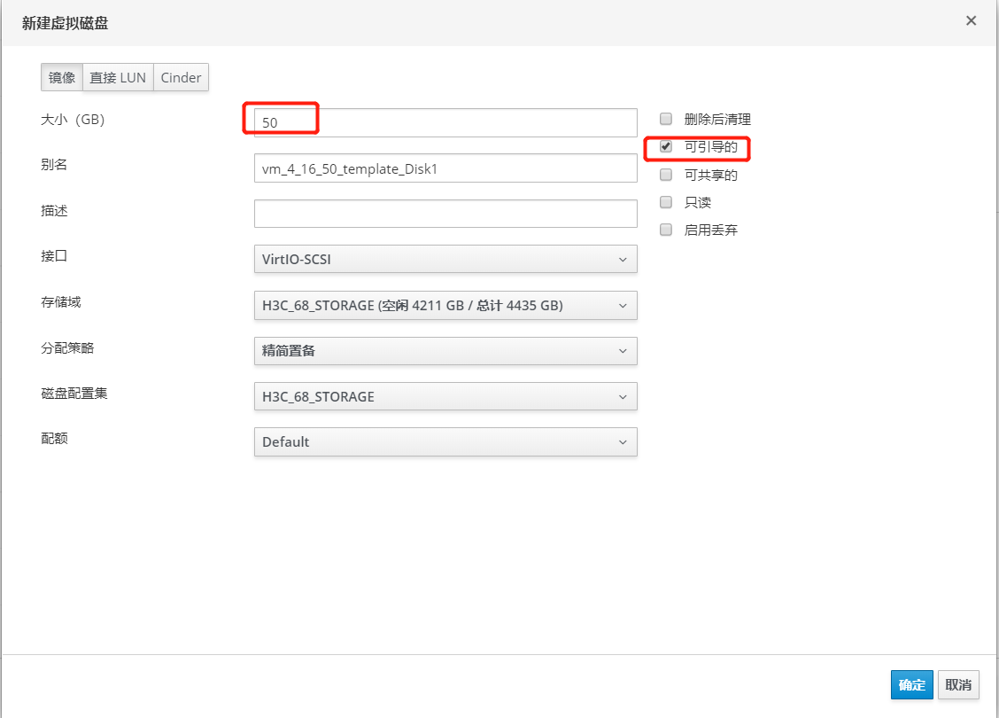

添加网络

配置内存cpu、时区

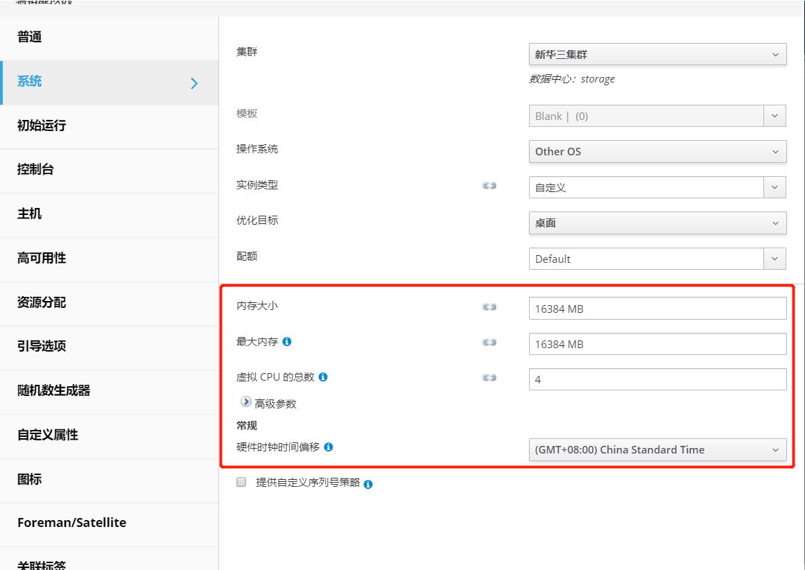

配置引导

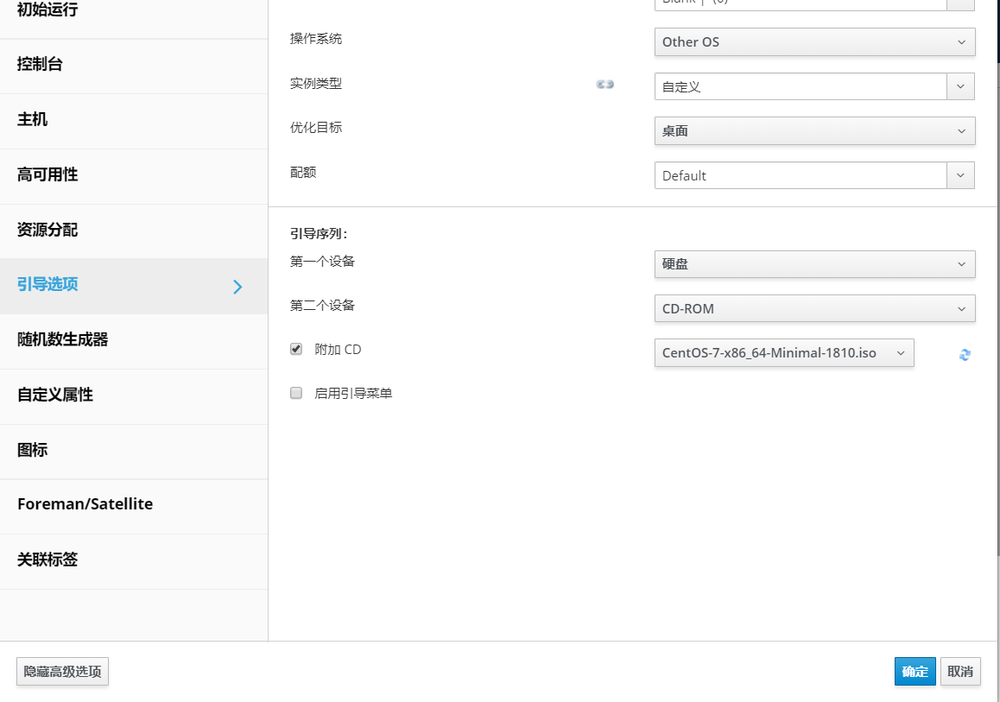

安装图形化界面客户端

[windows下载地址](https://releases.pagure.org/virt-viewer/virt-viewer-x64-8.0.msi)

启动、打开控制台

打开文件、安装操作系统

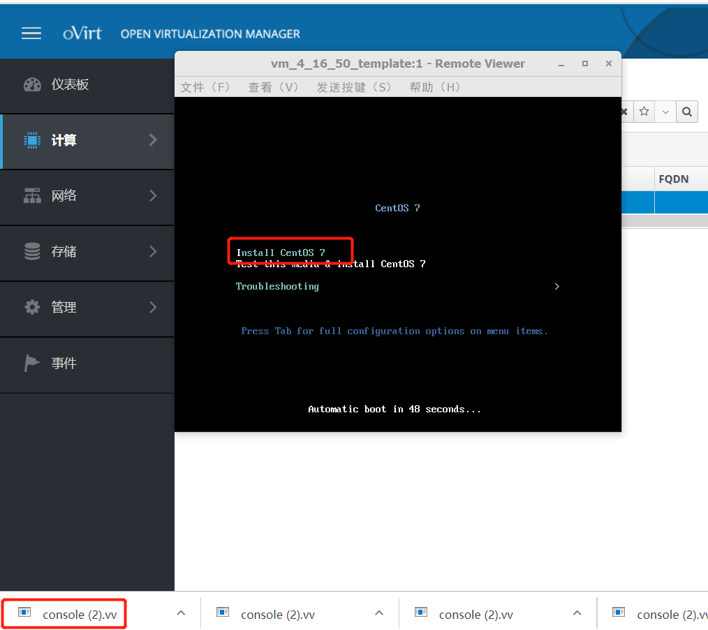

关机虚机、点击右上角... 创建模板

填写模板信息

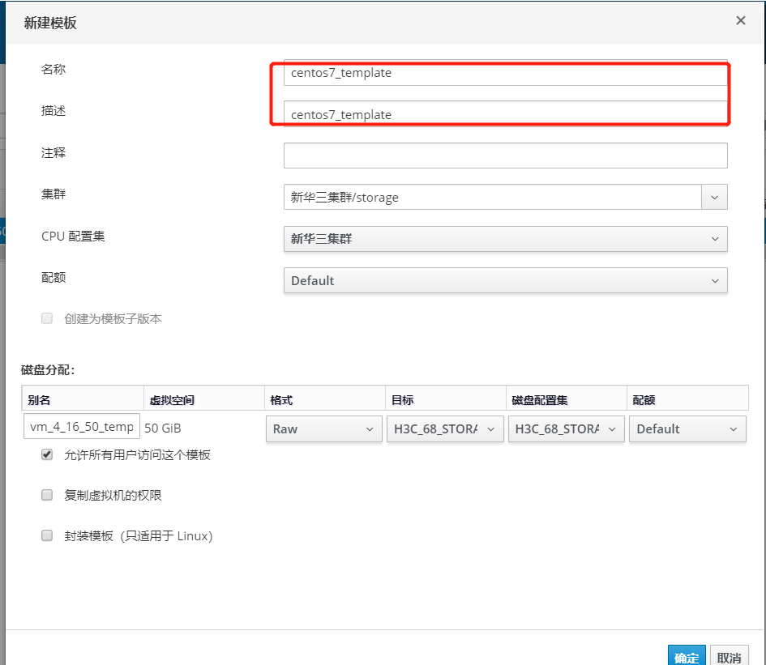

从模板机创建虚拟机

计算 -> 模板 -> 创建虚拟机

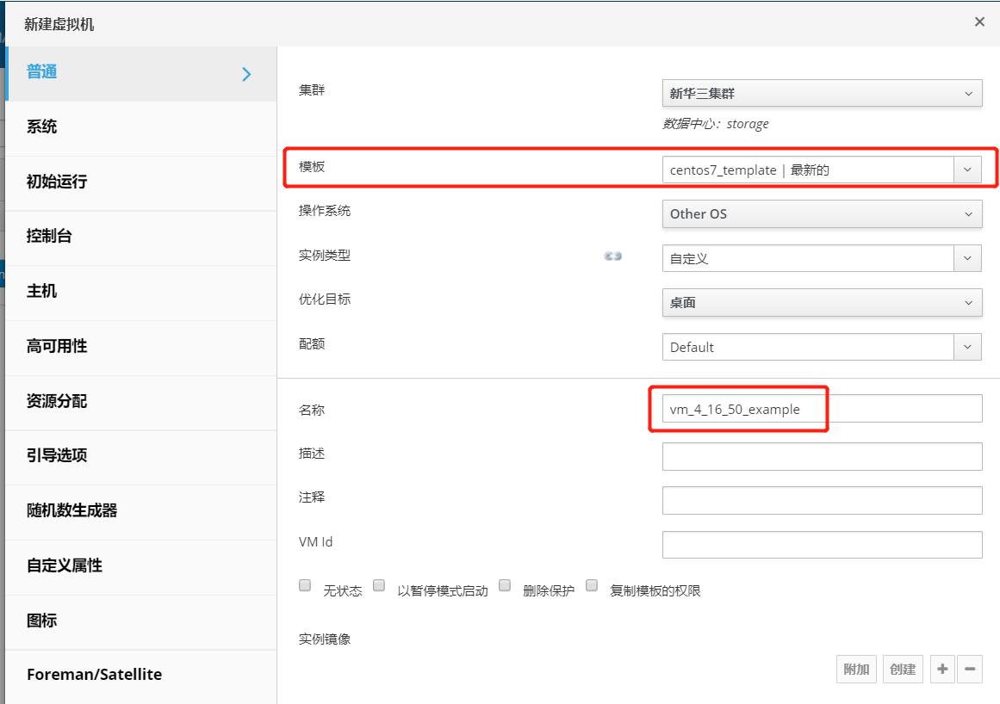

