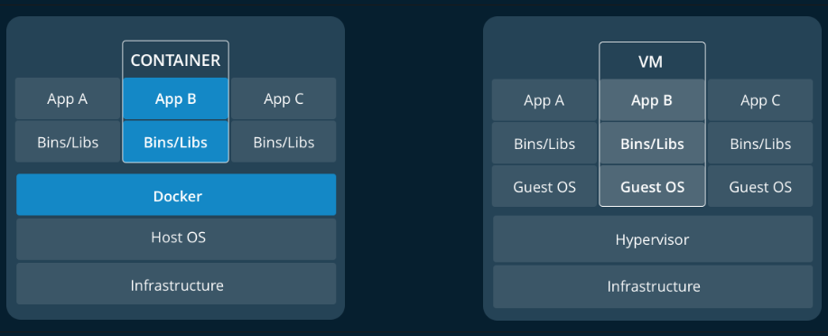

## 配置代理 ##

	#适用场景：内网访问互联网docker镜像仓库
	mkdir -p /etc/systemd/system/docker.service.d

	cat > /etc/systemd/system/docker.service.d/http-proxy.conf <<EOF
	[Service]
	Environment="HTTP_PROXY=http://xxx.xxx.xxx.xxx:xxxx"
	EOF

	systemctl daemon-reload && systemctl restart docker

## 配置加速 ##

	#参考地址
	https://cr.console.aliyun.com/cn-hangzhou/instances/mirrors

	sudo mkdir -p /etc/docker
	sudo tee /etc/docker/daemon.json <<-'EOF'
	{
	  "registry-mirrors": ["https://jz73200c.mirror.aliyuncs.com"]
	}
	EOF
	sudo systemctl daemon-reload
	sudo systemctl restart docker   

## 下载镜像 ##

`docker pull`

	docker pull docker.elastic.co/elasticsearch/elasticsearch:7.3.0

## 查看镜像 ##
 
`docker images`

	docker images

## 持久化镜像 ##

`docker save -o 目标目录/镜像文件名称 本地镜像:镜像tag值`

	docker save -o /root/elasticsearch-7.3.0.tar docker.elastic.co/elasticsearch/elasticsearch:7.3.0

## 容器VS虚机 ##

官方解释:

A container runs natively on Linux and shares the kernel of the host machine with other containers. It runs a discrete process, taking no more memory than any other executable, making it lightweight.

By contrast, a virtual machine (VM) runs a full-blown “guest” operating system with virtual access to host resources through a hypervisor. In general, VMs provide an environment with more resources than most applications need

显然，docker相较传统的VM占用更少的资源（内存、CPU、磁盘等）