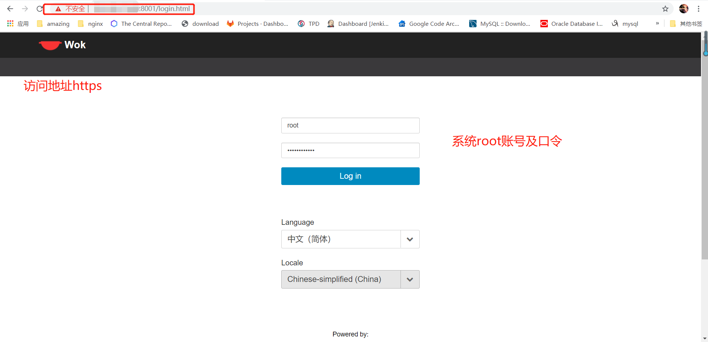

## 安装kvm ##

关闭selinux
	
	setenforce 0
	sed -i "s#SELINUX=enforcing#SELINUX=disabled#g" /etc/selinux/config

安装依赖

	yum install kvm kmod-kvm qemu -y

判断是否载入kvm模块

	/sbin/lsmod | grep kvm

拷贝指令

	cp /usr/libexec/qemu-kvm /usr/bin/

## KVM的web管理界面 ##

`Wok`

Wok基于cherrypy的web框架，可以通过一些插件来进行扩展，例如：虚拟化管理、主机管理、系统管理。它可以在任何支持HTML5的网页浏览器中运行。

`Kimchi`

Kimchi是一个基于HTML5的KVM管理工具，是Wok的一个插件（使用Kimchi前一定要先安装了wok），通过Kimchi可以更方便的管理KVM。

[项目地址](https://github.com/kimchi-project)

安装work

[wok下载链接](https://github.com/kimchi-project/wok/releases/download/2.5.0/wok-2.5.0-0.el7.centos.noarch.rpm)

	yum install -y wok-2.5.0-0.el7.centos.noarch.rpm

安装kimchi

[kimchi下载链接](https://github.com/kimchi-project/kimchi/releases/download/2.5.0/kimchi-2.5.0-0.el7.centos.noarch.rpm)

	yum install -y kimchi-2.5.0-0.el7.centos.noarch.rpm

启动wok

	systemctl daemon-reload
	systemctl start wokd
	
开放8001端口

	firewall-cmd --zone=public --add-port=8001/tcp --permanent
	#重新载入
	firewall-cmd --reload

访问

## 安装vnc

安装拷贝文件

	yum install tigervnc-server -y
	cp /lib/systemd/system/vncserver@.service /etc/systemd/system/vncserver.service
	
修改配置

	vim /etc/systemd/system/vncserver.service

设置密码

	

重载启动

	systemctl daemon-reload

