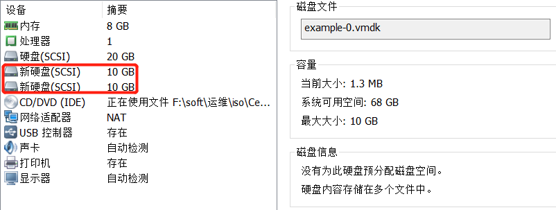
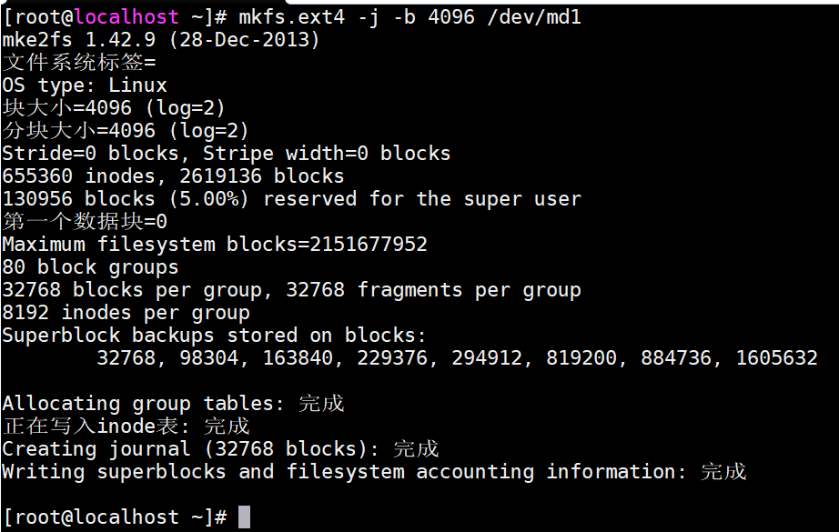
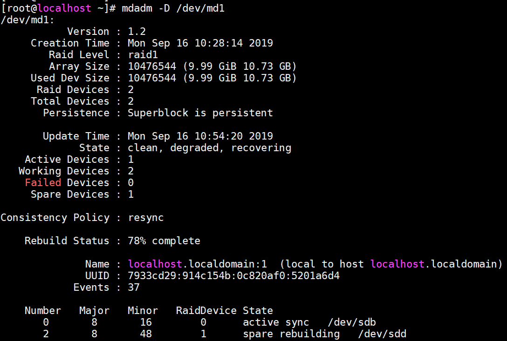
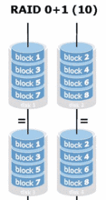

[信息来源](https://baike.baidu.com/item/%E7%A3%81%E7%9B%98%E9%98%B5%E5%88%97/1149823?fr=aladdin)

> 简介

磁盘阵列（Redundant Arrays of Independent Drives，RAID），有“独立磁盘构成的具有冗余能力的阵列”之意。
 
磁盘阵列是由很多块独立的磁盘，组合成一个容量巨大的磁盘组，利用个别磁盘提供数据所产生加成效果提升整个磁盘系统效能。利用这项技术，将数据切割成许多区段，分别存放在各个硬盘上。

磁盘阵列还能利用同位检查（Parity Check）的观念，在数组中任意一个硬盘故障时，仍可读出数据，在数据重构时，将数据经计算后重新置入新硬盘中。

> 功能

RAID技术主要有以下三个基本功能：

1. 通过对磁盘上的数据进行条带化，实现对数据成块存取，减少磁盘的机械寻道时间，提高了数据存取速度。 

1. 通过对一个阵列中的几块磁盘同时读取，减少了磁盘的机械寻道时间，提高数据存取速度。

1. 通过镜像或者存储奇偶校验信息的方式，实现了对数据的冗余保护

> 分类

磁盘阵列其样式有三种，一是外接式磁盘阵列柜、二是内接式磁盘阵列卡，三是利用软件来仿真。

1. 外接式磁盘阵列柜最常被使用大型服务器上，具可热交换（Hot Swap）的特性，不过这类产品的价格都很贵。

1. 内接式磁盘阵列卡，因为价格便宜，但需要较高的安装技术，适合技术人员使用操作。硬件阵列能够提供在线扩容、动态修改阵列级别、自动数据恢复、驱动器漫游、超高速缓冲等功能。它能提供性能、数据保护、可靠性、可用性和可管理性的解决方案。阵列卡专用的处理单元来进行操作。 

1. 利用软件仿真的方式，是指通过网络操作系统自身提供的磁盘管理功能将连接的普通SCSI卡上的多块硬盘配置成逻辑盘，组成阵列。软件阵列可以提供数据冗余功能，但是磁盘子系统的性能会有所降低，有的降低幅度还比较大，达30%左右。因此会拖累机器的速度，不适合大数据流量的服务器。

## RAID 0

**原理**

数据分片至不同的磁盘上

**磁盘数量**

2块以上

**冗余能力**

不具有冗余能力

**磁盘利用率**

100%

**适用场景**

数据安全性要求不高

## RAID 1

**原理**

把一个磁盘的数据镜像到另一个磁盘上

**磁盘数量**

偶数块（保证副本集非0）

**冗余能力**

具有冗余能力

**磁盘利用率**

50%

**适用场景**

保存关键性的重要数据

## 实现raid1

虚拟机添加两块硬盘

安装raid管理工具mdadm

	yum install -y mdadm

查看磁盘情况

	fdisk -l

创建raid1

**-n表示副本集**

	 mdadm -C /dev/md1 -n 2 -l 1 -a yes /dev/sd{b,c}

查看raid信息

	cat /proc/mdstat

格式化

	mkfs.ext4 -j -b 4096 /dev/md1

挂载

	mkdir /mnt1
	mount /dev/md1 /mnt1
	echo "/dev/md1 /mnt1                       ext4     defaults        0 0" >> /etc/fstab

写数据

	mkdir /mnt1/abc && touch /mnt1/abc/123

模拟损坏其中一个磁盘块

	mdadm /dev/md1 -f /dev/sdc

查看raid信息

	

新增磁盘设备，添加到md1

	mdadm /dev/md1 -a /dev/sdd

查看raid信息

	

删除已损坏的硬盘

	mdadm /dev/md1 -r /dev/sdc

关闭raid

	mdadm -S /dev/md1

## RAID0+1

**原理**

把一个磁盘的数据镜像到另一个磁盘上

**磁盘数量**

至少4个硬盘

**冗余能力**

具有冗余能力

**磁盘利用率**

50%

**适用场景**

保存关键性的重要数据

## raid5

**原理**

**磁盘数量**

至少3个硬盘

**冗余能力**

具有冗余能力

**磁盘利用率**

(N-1)/N，即只浪费一块磁盘用于奇偶校验

**适用场景**

保存关键性的重要数据

## raid10

Raid 10是一个Raid 1与Raid0的组合体，它是利用奇偶校验实现条带集镜像，
所以它继承了Raid0的快速和Raid1的安全。
我们知道，RAID 1在这里就是一个冗余的备份阵列，而RAID 0则负责数据的读写阵列。
其实，下图只是一种RAID 10方式，更多的情况是从主通路分出两路，做Striping操作，即把数据分割，
而这分出来的每一路则再分两路，做Mirroring操作，即互做镜像

**磁盘数量**

至少4个硬盘

**冗余能力**

具有冗余能力

**磁盘利用率**

50%

**适用场景**

保存关键性的重要数据

**注意一下Raid 10 和 Raid01的区别：**

RAID01又称为RAID0+1，先进行条带存放（RAID0），再进行镜像（RAID1）。

RAID10又称为RAID1+0，先进行镜像（RAID1），再进行条带存放（RAID0）。

[raid5 与 radi10对比](https://www.cnblogs.com/xd502djj/p/4324462.html)

